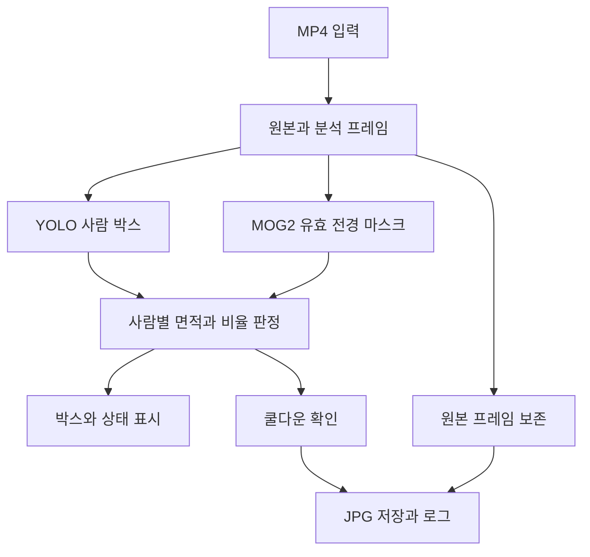
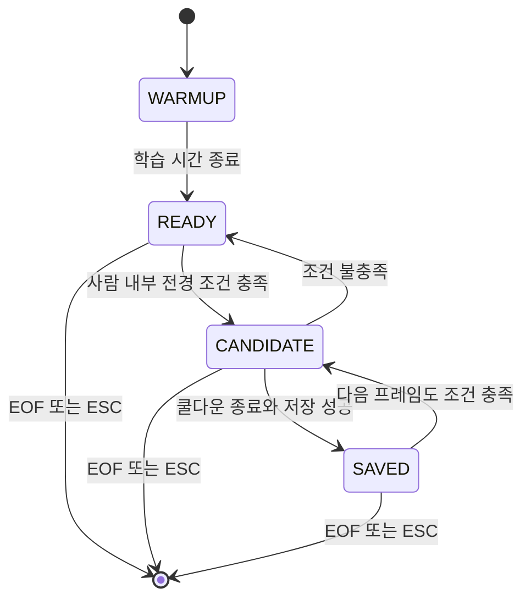

# motion_person_poc 개발 명세 (문서 버전 1.2 + 웹캠 미리보기·간편 CLI)

`cli.py`는 기존 처리기를 호출하는 간편 실행 진입점이다. macOS/Linux는 `motion`,
Windows는 `motion.cmd`로 실행한다. 인자 없는 터미널 실행은 메뉴를 표시하고,
`webcam`은 저장 없는 미리보기, `video <경로>` 또는 경로만 입력하면 파일 분석을 실행한다.
영상 경로를 생략한 상호작용 실행은 경로를 입력받는다. `doctor`는 설치 메타데이터와
모델 파일 존재만 확인하며 모델 추론·카메라 연결 성공을 뜻하지 않는다.
간편 영상 명령의 기본값은 tracking=true, capture_scope=object, cooldown=0.5초,
confidence=0.4, min_object_motion_pixels_ref=1000이다. 나머지는 기존 Config를 따른다.
기존 `main.py`의 기본값·로그 형식·종료 코드는 유지하고 간편 명령에서만 콘솔 안내를 한국어로 표시한다.
입력·모델 파일 부재는 실행 준비 전에 안내한다. 모델과 기본 결과 폴더는 모듈 위치 기준,
사용자가 입력한 상대 경로는 호출한 작업 폴더 기준이다. 한국어 대상 별칭은 모델의 종류로 매핑하며
`사람`·`아기`를 별도 종류로 분류하지 않는다.

파일 분석 명세와 별도로 `webcam_preview.py`가 저장 없는 웹캠 시험을 제공한다.
`webcam_source.py`는 백그라운드에서 최신 프레임 하나를 보관하고 단조 증가 경과 시간을 반환한다.
이 경로는 CaptureManager/RunLogger를 사용하지 않고 CaptureResult.status=DISABLED로 표시한다.
모든 선택 객체를 움직임 충족 여부와 무관하게 표시하며, 적격 객체만 노란색으로 강조한다.
카메라 재연결, RTSP, 장시간 운영은 이 미리보기 범위에 포함하지 않는다.
아래 MP4/캡처 계약은 기존 `main.py`에 계속 적용한다.

버전 1.2의 추적 기본 프로필은 `stable`이다. 프레임당 YOLO 추론 1회 결과를 종류별
독립 Ultralytics 추적기에 전달하며 탐지가 없는 종류도 매 프레임 진행한다. 클래스별
출력의 검출 인덱스와 ReID 특징은 원래 검출 목록에 정확히 대응해야 한다.
기본값은 추적 유지 60 업데이트, 새 번호 신뢰도 0.4, 캡처 전 관측 확인 3회다.
`--tracking-profile baseline` CLI는 이전 연결 방식 및 30/0.25/1 기본값으로 비교한다.
확인 횟수는 사용자 신뢰도를 통과한 관측만 누적하며, 부족한 객체는 `confirmed=false`,
`TRACK_PENDING`으로 저장 조건에서 제외한다. 확인을 마친 ID는 같은 ID로 복구하면
확정 상태를 유지한다. 예측된 위치만으로 관측 횟수를 늘리거나 캡처를 만들지 않는다.
`--tracker botsort --reid`는 기존 YOLO 특징으로 외형 연결을 켜고 고정 카메라에서는
`gmc_method=none`을 쓴다. 실제 추적 YAML은 실행 로그 폴더에 저장한다.

`--roi X1 Y1 X2 Y2`는 원본 대비 0~1 좌표의 선택 분석 영역이다. 픽셀 시작은 floor,
끝은 ceil로 계산한다. YOLO와 MOG2에는 같은 ROI 분석 프레임을 전달하며 원본 좌표
변환에는 ROI 시작 위치를 더한다. 캡처는 원본 전체 JPG, 면적 기준은 실제 분석 크기로
보정한다. `FramePacket.roi_xyxy`와 로그 `analysis_roi_xyxy`에 픽셀 영역을 기록한다.
원본 전체 화면이 기본이며 분석 ROI를 자동으로 찾거나 장면 전환에 따라 바꾸지 않는다.
동일 개체 식별의 정확도는 정답 ID가 있는 별도 시험으로 판단한다.


버전 1.1에서 `--classes`, `--track`, `--tracker`, `--capture-scope object`를 선택적
확장으로 추가했다. 기본 명령은 아래의 사람 전용 계약을 유지한다. 추적을 켜면
`PersonDetection`/`PersonMotionEvidence`에 종류 이름, 실행 내 `track_id`, 원래
`tracker_id`가 추가되며 `ObjectDetection`/`ObjectMotionEvidence` 별칭으로도 사용한다.
`FrameDecision.objects`는 기존 `persons` 데이터의 객체 공통 조회 인터페이스다.
다중 종류 모드의 상태는 `MOVING_OBJECT`, `OBJECT_ONLY`, `OBJECT_AND_MOTION_UNMATCHED`다.
기존 로그의 `persons`는 사람만 기록하고 `objects`/`matched_objects`가 모든 선택 종류를
기록한다. `--confidence` 및 `--min-object-motion-*`는 기존 사람 옵션의 별칭으로
모든 선택 종류에 공통 적용한다.

추적 모드는 프레임 사이 상태를 유지하고 더미 모델 warmup은 추적기를 진행시키지 않는다.
종류와 원래 추적기 ID의 조합으로 실행 내 ID를 매핑해 종류가 바뀐 추적 결과를 같은
객체 상태에 섞지 않는다. 가림·누락·재입장·편집 컷의 물리적 객체 동일성은 보장하지 않는다.
객체별 쿨다운은 성공 저장을 발생시킨 ID에만 갱신하며 한 프레임당 JPG 한 장은 유지한다.
저장에 실패하면 전체/객체별 쿨다운과 저장 카운터를 갱신하지 않는다.
추적 화면의 상태 패널은 분석 영상 오른쪽에 배치하고 원본 캡처 크기는 유지한다.
추적의 상세 CLI, 로그, 실제 시험 결과는 [README](README.md)와
[객체 추적 테스트 보고서](docs/object_tracking_test_report.md)를 함께 따른다.

MP4 동영상에서 사전학습 YOLO로 사람을 탐지하고, 같은 프레임의 MOG2 전경 마스크를 사람 영역과 결합하여 조건에 맞는 순간의 원본 이미지를 저장한다. 개발팀은 이 문서의 데이터 계약, 판정 수식, 파일 규격과 테스트 기준을 기준으로 하나의 로컬 Python 모듈을 구현한다.

개발 범위는 **영상 입력 → YOLO 객체 탐지 및 MOG2 전경 탐지 → 두 결과 결합 → Bounding Box 표시 → 조건 충족 프레임을 captures에 저장**까지다. 사람은 기본 탐지 대상이며 추적은 선택 옵션이다. Gemini, LLM, 서버, DB, 웹 UI, 알림, 웹캠, RTSP와 얼굴 인식은 포함하지 않는다.

| 항목 | 기준 |
| - | - |
| 문서 버전 | 1.2 |
| 기준일 | 2026년 10월 8일 |
| 주요 독자 | Python 개발자와 팀 내 테스트 담당자 |
| 목표 실행 환경 | Windows 10과 Windows 11의 64비트 Python 3.11 환경 |
| 입력 | 로컬 MP4 파일 한 개 |
| 객체 탐지 | 사전학습 YOLO11n Detection 모델 |
| 움직임 단서 | OpenCV MOG2 전경 마스크 |
| 실행 장치 | CPU |
| 결과 | OpenCV 시연 창, JPG 캡처, JSONL 로그, 실행 요약 JSON |
| 구현 상태 | 구현 명세와 참조 코드이며 실제 영상 성능은 대상 노트북에서 측정한다 |

## 1 구현 결과와 완료 범위

### 1.1 개발자가 완성해야 할 동작

1. 명령행으로 받은 MP4 파일을 연다.

2. 원본 프레임을 보존하고 별도의 분석 프레임을 만든다.

3. 분석 프레임 한 장을 YOLO와 MOG2에 각각 전달한다.

4. YOLO 결과에서 confidence 기준을 만족하는 person 박스를 추출한다.

5. MOG2 마스크에서 그림자와 작은 노이즈를 제거한다.

6. 각 사람 박스 안의 유효 전경 픽셀 수와 비율을 계산한다.

7. 배경 초기 학습이 끝났고 면적과 비율이 기준 이상이면 캡처 후보로 판정한다.

8. 시연 화면에 사람 박스, 전경 영역 박스와 상태를 표시한다.

9. 캡처 후보가 있고 쿨다운이 끝났으면 Bounding Box가 없는 원본 프레임을 JPG로 저장한다.

10. 판정 근거와 저장 결과를 로그로 남긴다.

11. 영상 끝 또는 ESC 입력 시 파일과 영상 자원을 정리한다.

### 1.2 결과물 목록

| 결과물 | 필수 내용 |
| - | - |
| Python 소스 | 7절의 모듈 구성과 공개 인터페이스 |
| 설치 파일 | requirements.in과 검증 환경에서 만든 requirements.lock.txt |
| README.md | 설치, 모델 준비, 실행, 종료, 결과 확인 방법 |
| 모델 파일 | models/yolo11n.pt |
| 테스트 영상 | 사람이 들어오는 시연 영상과 25절 테스트 세트 |
| 캡처 결과 | 원본 해상도 JPG 파일 |
| 실행 로그 | 설정, 판정 변화, 캡처, 오류와 종료 기록 |
| 테스트 보고 | 영상별 실제 결과와 측정 환경 |

이 목록은 구현팀이 만들 결과물의 명세다. 본 문서는 모듈 개발에 필요한 규격과 참조 로직을 제공한다.

## 2 용어와 알고리즘의 해석

### 2.1 YOLO가 판단하는 내용

YOLO Detection 모델은 이미지에서 객체 종류, 사각형 위치와 confidence를 반환한다. 이 모듈은 모델의 Detection 결과 중 person만 사용한다. 사람을 별도 분류 모델에 다시 입력하거나 모델을 새로 학습하지 않는다. YOLO11에는 Detection 가중치 yolo11n.pt가 제공된다. [S1]

confidence 0.60은 이 모듈의 필터 기준이다. 이를 실제 사람일 확률이 정확히 60퍼센트라는 의미로 해석하지 않는다.

### 2.2 MOG2가 판단하는 내용

MOG2는 고정 카메라 영상에서 현재 프레임과 학습한 배경의 차이를 전경 마스크로 표현한다. 초기 배경을 만들고 이후 배경을 갱신하는 과정이 있다. [S3]

**전경은 현재 움직임 속도와 같은 값이 아니다.** 사람이 들어왔다가 멈추면 한동안 배경과 다른 객체로 남을 수 있다. 반대로 오래 머문 사람이 배경에 흡수되거나 아주 느린 변화가 배경 갱신에 따라 약해질 수 있다. 배경에 일정하게 남은 픽셀이 모델에 편입되는 동작은 MOG2 API에 설명되어 있다. [S4]

따라서 MOVING PERSON이라는 화면 문구의 정확한 구현 의미는 **사람 박스 안에서 충분한 배경 변화가 검출됨**이다. 실제 보행, 자세 변화나 이동 속도를 확정하는 기능으로 해석하지 않는다.

### 2.3 면적을 구분하는 이유

| 이름 | 정의 | 주 용도 |
| - | - | - |
| person_box_area | 사람 사각형의 너비 × 높이 | 비율의 분모 |
| motion_box_area | 전경 영역을 감싼 사각형의 면적 | 시각화와 진단 |
| contour_area | contourArea로 계산한 윤곽선 내부의 기하 면적 | 진단 |
| foreground_pixels | 유효 마스크에서 값이 255인 픽셀 수 | 전경 크기 계산 |
| person_motion_pixels | 사람 박스 안의 유효 전경 픽셀 수 | 캡처 판정 |
| person_motion_ratio | person_motion_pixels / person_box_area | 캡처 판정 |

Bounding Box에는 빈 공간이 포함된다. contourArea도 마스크의 흰 픽셀 개수와 같은 측정값으로 간주하지 않는다. OpenCV는 contourArea와 boundingRect를 별개 API로 제공한다. [S5]

## 3 기존 PRD에서 명확히 할 개발 결정

### 3.1 같은 프레임을 두 알고리즘에 전달한다

YOLO와 MOG2는 같은 분석 프레임 번호와 같은 좌표계를 사용한다. 서로 독립적인 분석 경로라는 뜻이며, 첫 구현에서 스레드나 프로세스를 동시에 실행해야 한다는 뜻은 아니다.

첫 구현은 한 스레드에서 순서대로 호출한다. 순서가 YOLO 다음 MOG2이든 MOG2 다음 YOLO이든 두 함수가 원본 분석 프레임을 수정하지 않으면 결합 결과의 계약은 같다.

MOG2 결과가 있을 때만 YOLO를 호출하는 최적화는 이번 기본 구현에 넣지 않는다. YOLO 결과를 프레임 사이에서 재사용하는 최적화도 넣지 않는다.

### 3.2 사각형 겹침 대신 실제 마스크를 사용한다

이전 PRD의 OVERLAP_THRESHOLD 0.30은 사각형 교집합 비율의 예시였다. 개발 명세에서는 이를 **사람 박스 내부 유효 전경 픽셀 비율**로 구체화한다.

이 수치는 같은 지표가 아니므로 0.30을 그대로 옮기지 않는다. 본 명세의 초기값은 MIN_PERSON_MOTION_RATIO = 0.03이다. 이는 팀 테스트를 시작하기 위한 설계값이며 정확도 검증 결과가 아니다. 비율 0.03만으로 캡처하지 않고 최소 픽셀 면적 조건을 함께 적용한다.

사람 박스 안에 배경도 포함될 수 있다. 이 방식은 사각형 겹침만 사용하는 방법보다 근거가 명확하지만, 사람 뒤의 커튼이나 조명 변화가 같은 박스에 포함되면 여전히 오탐할 수 있다.

### 3.3 원본과 분석 프레임을 구분한다

영상 저장용 raw_frame, 알고리즘용 analysis_frame, 화면 표시용 display_frame을 구분한다. 박스와 문구는 display_frame에만 그린다. raw_frame에는 그리지 않는다.

### 3.4 쿨다운은 영상 시간으로 계산한다

MP4를 느리게 분석하더라도 영상의 3초마다 캡처할 수 있도록 **영상 타임라인**을 사용한다. 실제 실행 시간으로 쿨다운을 계산하면 같은 영상도 CPU 속도에 따라 저장 수가 달라진다.

파일 생성 시각은 UTC 실제 시각으로 별도 저장한다. 영상 시간과 실제 시각을 서로 대신 사용하지 않는다.

### 3.5 정지한 사람의 즉시 무캡처를 보장하지 않는다

MOG2만으로 사람이 멈추는 즉시 전경이 사라진다는 조건은 만들 수 없다. 정지 테스트는 배경 변화가 안정된 구간에서 결과를 측정하고, 사람이 멈춘 후 잔여 캡처와 안정화 시간도 기록한다.

정지 직후 무조건 캡처를 금지하는 요구가 생기면 별도의 프레임 차분, 광학 흐름 또는 추적 기반 변화 판단이 필요하다. 이들은 이번 구현 범위에 추가하지 않는다.

## 4 기능 요구사항

| ID | 요구사항 | 완료 확인 |
| - | - | - |
| FR01 | 로컬 MP4를 연다 | 유효 영상에서 프레임을 읽는다 |
| FR02 | 메타데이터를 기록한다 | 원본 크기, FPS, 프레임 수와 신뢰 상태가 남는다 |
| FR03 | 분석 크기를 통일한다 | YOLO 박스와 MOG2 마스크 크기가 일치한다 |
| FR04 | 사전학습 YOLO를 한 번 로드한다 | 반복문 안에서 모델을 생성하지 않는다 |
| FR05 | person 결과만 사용한다 | 클래스 매핑 검증과 confidence 필터가 작동한다 |
| FR06 | MOG2를 순서대로 갱신한다 | 각 분석 프레임에 apply를 한 번 호출한다 |
| FR07 | 초기 배경 학습 중 저장을 억제한다 | WARMUP 동안 JPG가 생기지 않는다 |
| FR08 | 그림자와 작은 노이즈를 제거한다 | 마스크에는 0과 255만 남는다 |
| FR09 | 사람별 전경 면적을 계산한다 | 박스 내부 픽셀 수와 비율이 기록된다 |
| FR10 | 사람별 조건을 결합한다 | 다른 위치의 변화만으로 후보가 되지 않는다 |
| FR11 | 두 종류의 박스를 표시한다 | 화면에서 사람과 전경을 구분할 수 있다 |
| FR12 | 후보 프레임을 저장한다 | 원본 해상도와 내용이 유지된 JPG가 생긴다 |
| FR13 | 전역 쿨다운을 적용한다 | 성공한 캡처 사이의 영상 시간 간격이 기준 이상이다 |
| FR14 | 한 프레임은 한 번 저장한다 | 사람이 여럿이어도 같은 프레임 JPG는 한 개다 |
| FR15 | 저장 실패를 식별한다 | 성공 로그나 쿨다운 갱신 없이 오류를 처리한다 |
| FR16 | 종료를 정리한다 | 영상, 창과 로그를 닫고 요약을 남긴다 |
| FR17 | 화면 없이 테스트한다 | --no-display 옵션으로 같은 판정 로직을 실행한다 |

## 5 품질 요구사항

| ID | 요구사항 | 구현 방침 |
| - | - | - |
| NFR01 | CPU에서 실행 가능 | device를 cpu로 고정한다 |
| NFR02 | 재현 가능한 비교 | 모델 해시, 패키지 버전, 설정, 영상 식별 정보를 기록한다 |
| NFR03 | 제한된 메모리 | 프레임 전체와 마스크 전체를 영상 길이만큼 보관하지 않는다 |
| NFR04 | 한글 경로 대응 | pathlib와 imencode 기반 저장을 사용하고 Windows에서 확인한다 |
| NFR05 | 결과 파일 충돌 방지 | 실행 폴더, 영상 프레임 번호와 시퀀스를 사용한다 |
| NFR06 | 판정과 저장의 분리 | 조건 불충족, 쿨다운 억제와 저장 실패를 구별한다 |
| NFR07 | 처리속도 측정 | 순수 처리시간과 재생 대기를 구분한다 |
| NFR08 | 정상 종료 | EOF, ESC, Ctrl C를 각각 식별한다 |

처리속도는 기능 완료와 별도로 평가한다. **CPU에서 20 FPS 이상은 측정 목표이며 모든 노트북에서 보장하는 조건이 아니다.** 첫 구현은 프레임을 건너뛰지 않고 처리하며, 성능이 낮으면 느리게 재생하되 분석 결과를 유지한다.

## 6 처리 구조



YOLO와 MOG2가 받는 픽셀 배열의 크기는 같다. 알고리즘별 전처리와 모델 내부 리사이즈는 각 라이브러리가 수행한다. 모듈 바깥으로 반환하는 박스는 analysis_frame 기준 좌표로 통일한다.

## 7 프로젝트와 모듈 구성

프로젝트 이름은 motion_person_poc로 한다. 아래 경로는 개발팀이 생성할 프로젝트의 상대 경로다.

| 경로 | 책임 |
| - | - |
| main.py | 시작, 프레임 반복, 저장 호출, 화면 제어와 종료 |
| config.py | 기본 설정, CLI 값 병합과 검증 |
| contracts.py | 공통 데이터 타입과 좌표 규칙 |
| video_source.py | MP4 읽기, 프레임 번호와 영상 시간 |
| frame_processor.py | 분석 리사이즈와 원본 좌표 변환 |
| object_detector.py | YOLO 로드와 사람 박스 추출 |
| motion_detector.py | MOG2, 마스크 정리와 전경 영역 |
| event_detector.py | 사람별 면적과 비율 판정 |
| capture_manager.py | 쿨다운, JPG 인코딩과 파일 저장 |
| overlay_renderer.py | 박스, 상태와 성능 표시 |
| run_logger.py | JSONL, 설정 기록과 종료 요약 |
| requirements.in | 설치할 직접 의존성 |
| requirements.lock.txt | 대상 환경에서 검증한 전체 버전 |
| README.md | 설치와 시연 안내 |
| models/yolo11n.pt | 사전학습 Detection 가중치 |
| videos/ | 테스트 영상 |
| captures/ | 실행별 JPG 폴더 |
| logs/ | 실행별 로그와 요약 |
| tests/ | 판정, 시간과 저장 계약 테스트 |
| test_data/ | 영상 정답 구간과 평가 결과 |

프로젝트를 하나의 Python 프로그램으로 유지한다. 라이브러리 배포, 패키지 레지스트리, 웹 서비스화는 필요 없다. 모듈 분리는 입력과 알고리즘을 독립적으로 검증하기 위한 구성이다.

## 8 공통 데이터 계약

### 8.1 프레임과 박스 규칙

- 이미지 배열은 uint8이며 색상 채널은 BGR 순서다.

- raw_frame 형태는 H × W × 3이다.

- analysis_frame 형태는 h × w × 3이다.

- 마스크 형태는 h × w이며 값은 0 또는 255다.

- 좌표 원점은 왼쪽 위다. x는 오른쪽, y는 아래 방향으로 증가한다.

- 박스는 정수 xyxy 형식이다.

- x1과 y1은 포함하며 x2와 y2는 제외한다.

- 유효 박스는 0 ≤ x1 < x2 ≤ w와 0 ≤ y1 < y2 ≤ h를 만족한다.

- 슬라이스는 mask[y1, x1]로 한다.

- 배열 입력을 받는 분석 함수는 호출자가 넘긴 프레임에 박스나 글자를 그리지 않는다.

xywh의 x와 y가 중심 좌표인지 왼쪽 위인지 혼동할 수 있으므로 공개 계약에는 사용하지 않는다. 표시를 위해 너비가 필요하면 x2 − x1로 계산한다.

### 8.2 타입 정의

다음은 contracts.py의 구현 기준이다. FramePacket의 배열은 논리적으로 읽기 전용이다. frozen dataclass가 NumPy 배열 자체의 수정까지 막는 것은 아니므로 각 소비 모듈이 수정 금지 계약을 지켜야 한다.

```python
from dataclasses import dataclass
from pathlib import Path
from typing import Literal
import numpy as np

@dataclass(frozen=True)
class Box:
    x1: int
    y1: int
    x2: int
    y2: int

    @property
    def area(self) -> int:
        return max(0, self.x2 - self.x1) * max(0, self.y2 - self.y1)

@dataclass(frozen=True)
class VideoInfo:
    path: Path
    fps: float
    reported_frame_count: int | None
    width: int
    height: int
    timeline_source: str
    timing_trusted: bool

@dataclass(frozen=True)
class FramePacket:
    run_id: str
    frame_index: int
    video_time_sec: float
    raw_frame: np.ndarray
    analysis_frame: np.ndarray
    scale_x: float
    scale_y: float

@dataclass(frozen=True)
class PersonDetection:
    detection_index: int
    box: Box
    confidence: float
    class_id: int

@dataclass(frozen=True)
class MotionRegion:
    box: Box
    contour_area: float

@dataclass(frozen=True)
class MotionResult:
    valid_mask: np.ndarray
    regions: tuple[MotionRegion, ...]
    foreground_pixels: int
    frame_foreground_ratio: float
    warming_up: bool

@dataclass(frozen=True)
class PersonMotionEvidence:
    detection_index: int
    box: Box
    confidence: float
    motion_pixels: int
    motion_ratio: float
    qualifies: bool
    rejection_reasons: tuple[str, ...]

@dataclass(frozen=True)
class FrameDecision:
    frame_index: int
    video_time_sec: float
    status: Literal[
        "WARMUP", "IDLE", "PERSON_ONLY", "MOTION_ONLY",
        "PERSON_AND_MOTION_UNMATCHED", "MOVING_PERSON"
    ]
    candidate: bool
    persons: tuple[PersonMotionEvidence, ...]

@dataclass(frozen=True)
class CaptureResult:
    status: Literal["NOT_ELIGIBLE", "COOLDOWN", "SAVED"]
    path: Path | None
    video_time_sec: float
    cooldown_remaining_sec: float
    sequence: int | None
```

저장에 실패하면 CaptureResult의 SAVED를 반환하지 않는다. CaptureSaveError를 발생시키고 main.py가 비정상 종료로 처리한다. detection_index는 해당 프레임 안에서만 유효한 번호이며 프레임 사이의 사람 ID나 추적 ID가 아니다.

## 9 설정값 명세

### 9.1 초기 설정

| 설정 키 | 기본값 | 단위와 의미 |
| - | - | - |
| analysis_width | 960 | 분석 프레임 최대 너비 px |
| reference_width | 960 | 면적 기준 너비 px |
| reference_height | 540 | 면적 기준 높이 px |
| model_path | models/yolo11n.pt | 로컬 Detection 가중치 |
| device | cpu | 추론 장치 |
| yolo_imgsz | 640 | 모델 추론 입력 크기 |
| person_confidence | 0.60 | 사람 confidence 하한 |
| yolo_iou | 0.50 | YOLO 중복 박스 억제용 값 |
| max_detections | 100 | 프레임별 모델 결과 수 제한 |
| mog2_history | 500 | 배경 모델의 이력 설정 |
| mog2_var_threshold | 16.0 | 배경 모델 일치 판단 설정 |
| mog2_detect_shadows | true | 그림자를 별도 값으로 표시 |
| mog2_learning_rate | -1.0 | 라이브러리 자동 갱신율 사용 |
| warmup_sec | 2.0 | 처음 저장을 억제할 영상 시간 |
| open_kernel | 3 | opening 커널 한 변 크기 |
| close_kernel | 5 | closing 커널 한 변 크기 |
| morphology_iterations | 1 | 각 연산 반복 수 |
| min_component_pixels_ref | 100 | 기준 해상도에서 작은 연결 영역 제거 기준 |
| min_person_motion_pixels_ref | 3000 | 기준 해상도에서 사람 내부 최소 전경 픽셀 수 |
| min_person_motion_ratio | 0.03 | 사람 박스 안의 전경 비율 하한 |
| capture_cooldown_sec | 3.0 | 성공한 캡처 간 최소 영상 시간 |
| jpeg_quality | 95 | JPG 인코딩 품질 |
| display | true | OpenCV 창 표시 |
| show_mask | false | 마스크 창 추가 표시 |
| pace | realtime | 원본 속도에 맞춰 가능한 범위에서 대기 |
| fallback_fps | 없음 | FPS가 유효하지 않을 때 사용자가 지정하는 값 |
| metrics_interval_sec | 1.0 | 실제 시간 기준 성능 로그 주기 |
| debug_decisions | false | 매 프레임 상세 판정 로그 |

위 값은 초기 비교 실험을 위한 설정이다. 특정 카메라나 영상에서 최적값으로 검증된 값이 아니다. YOLO iou는 사람 박스와 전경의 겹침 기준이 아니다.

### 9.2 config.py 인터페이스

```python
def build_config(args: list[str] | None = None) -> Config:
    """기본값에 CLI를 반영하고 검증한 설정을 반환한다."""

def validate_config(config: Config) -> None:
    """범위 오류나 서로 충돌하는 옵션이면 ConfigError를 발생시킨다."""

def config_to_dict(config: Config) -> dict:
    """Path 등도 JSON으로 기록 가능한 값으로 바꾼다."""
```

우선순위는 기본값 다음 CLI다. 첫 버전에는 환경변수, GUI 설정, 원격 설정과 YAML 로더를 추가하지 않는다. 파일로 남은 run_config.json은 실행 당시의 최종 유효 설정을 기록하는 용도다.

### 9.3 검증 규칙

- confidence와 비율은 0 이상 1 이하다.

- yolo_iou는 0보다 크고 1 이하다.

- 분석 너비, reference 크기, imgsz, history와 max_detections는 양의 정수다.

- 면적 기준은 양의 정수다.

- 커널 크기는 1 이상의 홀수다.

- warmup과 cooldown은 0 이상의 유한한 수다.

- learning_rate는 -1 또는 0 이상 1 이하다.

- jpeg_quality는 1 이상 100 이하의 정수다.

- device는 cpu다.

- pace는 realtime 또는 fast다.

- fallback_fps가 지정되면 양의 유한한 수여야 한다.

- 영상 파일과 모델 파일은 실제로 존재하는 일반 파일이어야 한다.

- 이미지 저장 폴더와 로그 폴더는 시작 시 생성과 쓰기가 가능해야 한다.

- config에 NaN, infinity를 허용하지 않는다.

### 9.4 해상도에 따른 면적 보정

분석 프레임 전체 면적을 기준 면적으로 나눈 계수를 쓴다.

```text
area_scale = analysis_width_actual × analysis_height_actual / (reference_width × reference_height)
min_component_pixels = max(1, ceil(min_component_pixels_ref × area_scale))
min_person_motion_pixels = max(1, ceil(min_person_motion_pixels_ref × area_scale))
```

| 실제 분석 크기 | 계수 | 최소 사람 전경 픽셀 |
| - | - | - |
| 960 × 540 | 1.0 | 3000 |
| 640 × 360 | 약 0.4444 | 1334 |
| 480 × 270 | 0.25 | 750 |
| 960 × 720 | 약 1.3333 | 4000 |

이 보정은 프레임 크기에 대한 정규화다. 피사체까지의 거리나 사람 크기를 자동 보정하는 방식은 아니다. 작은 사람의 박스 면적 자체가 최소 픽셀 기준보다 작으면 후보가 되지 않는다.

## 10 영상 입력 모듈

### 10.1 책임과 인터페이스

video_source.py는 영상 읽기, 입력 검증과 영상 시간을 담당한다. YOLO, MOG2와 캡처 조건을 알 필요가 없다.

```python
class VideoSource:
    def __init__(self, video_path: Path, fallback_fps: float | None): ...
    def open(self) -> VideoInfo: ...
    def read(self) -> tuple[int, float, np.ndarray] | None: ...
    def close(self) -> None: ...
```

read의 반환값은 frame_index, video_time_sec, raw_frame 순서다. 읽기 종료 시 None이다. 첫 성공 프레임 번호는 0이다.

### 10.2 파일 열기 절차

1. 영상 경로를 절대 경로로 변환한다.

2. 존재하는 일반 파일인지 확인한다.

3. cv2.VideoCapture로 연다.

4. isOpened가 false이면 VideoOpenError다.

5. FPS와 보고된 프레임 수를 읽고 유효성을 확인한다.

6. 첫 프레임을 읽어 실제 이미지 크기를 확인한 뒤 버퍼에 보관한다.

7. 첫 프레임도 읽을 수 없으면 VideoDecodeError다.

8. 첫 read는 보관한 첫 프레임을 반환한다. 준비 과정에서 첫 프레임이 빠지지 않게 한다.

CAP_PROP_FRAME_WIDTH와 HEIGHT는 진단용으로 기록할 수 있지만 프레임 배열의 shape가 크기의 최종 기준이다.

### 10.3 영상 시간

첫 버전의 정식 입력은 **고정 프레임레이트 MP4**다. 명목 FPS가 정상이라면 다음 값을 사용한다.

```text
video_time_sec = frame_index / fps
timeline_source = frame_index_over_fps
```

CAP_PROP_POS_MSEC는 백엔드와 파일에 따라 값이 다를 수 있어 진단용으로만 선택적으로 기록한다. 서로 다른 시간 계산을 실행 중 자동으로 오가면 안 된다.

FPS가 0, 음수 또는 NaN이면 기본적으로 실행을 중단한다. 사용자가 --fallback-fps 30처럼 명시한 경우 그 값으로 진행하되 timing_trusted를 false로 기록한다. 정상 FPS를 사용해도 파일이 VFR인지 이 모듈이 완전히 판별하는 것은 아니다. 테스트 담당자가 입력을 CFR로 준비한다.

가변 프레임레이트 영상은 일정 FPS의 MP4로 변환 후 테스트한다. 실제 PTS를 사용하는 디코더 지원은 별도 확장이다.

### 10.4 EOF와 디코딩 오류

OpenCV read 실패 한 번만으로 모든 파일에서 EOF와 손상을 확정적으로 구별할 수는 없다. 시작부터 실패하면 오류다. 처리 중 실패하면 보고된 프레임 수와 실제 읽은 수를 함께 남긴다.

보고된 총 프레임 수가 유효하고 실제 읽은 수보다 2프레임을 초과해 크면 EARLY_READ_FAILURE로 기록하고 비정상 종료한다. 프레임 수가 불명확하면 END_OF_STREAM_OR_DECODE_FAILURE로 기록하여 판별 한계를 남긴다. 파일 메타데이터가 틀린 경우도 이 규칙에 영향을 준다.

디코더가 예외를 발생시키면 프레임 수와 관계없이 VIDEO_DECODE_ERROR, 종료 코드 3으로 처리한다. 예외 없이 읽기가 끝나고 보고된 프레임 수와 실제 읽은 수가 같으면 END_OF_STREAM을 기록한다. 프레임 수가 불명확하거나 2프레임 이내의 차이가 있으면 END_OF_STREAM_OR_DECODE_FAILURE와 INPUT_COMPLETION_UNVERIFIED 경고를 기록하고 종료 코드 0으로 최선의 처리를 끝낸다. 후자의 0은 전체 영상 완료를 검증했다는 뜻이 아니다. summary의 input_completion_verified는 END_OF_STREAM에 도달한 경우에만 true이며, 이는 메타데이터와 읽은 수가 일치한다는 확인이다.

### 10.5 자원 해제

close는 중복 호출되어도 안전해야 한다. ESC, Ctrl C, 모델 예외와 저장 오류에서도 finally에서 VideoCapture.release를 호출한다.

## 11 프레임 전처리와 좌표 변환

### 11.1 분석 크기

frame_processor.py는 원본 비율을 유지해 분석 너비를 줄인다. 작은 원본을 960까지 확대하지 않는다.

```text
analysis_w = min(original_w, configured_analysis_width)
analysis_h = max(1, round(original_h × analysis_w / original_w))
scale_x = original_w / analysis_w
scale_y = original_h / analysis_h
```

960으로 나누어떨어지지 않는 원본에서는 높이 반올림 때문에 scale_x와 scale_y가 약간 달라질 수 있다. 하나의 scale 값으로 둘 다 대신하지 않는다.

### 11.2 공개 인터페이스

```python
def make_packet(
    run_id: str, frame_index: int, video_time_sec: float,
    raw_frame: np.ndarray, analysis_width: int
) -> FramePacket: ...

def box_to_original(box: Box, packet: FramePacket) -> Box: ...
```

박스의 왼쪽과 위는 floor, 오른쪽과 아래는 ceil로 변환한 뒤 원본 이미지 범위로 clip한다.

예를 들어 원본 1920 × 1080, 분석 960 × 540, 분석 박스 [100, 50, 200, 250]이면 원본 박스는 [200, 100, 400, 500]이다.

### 11.3 프레임 복사 규칙

분석 크기가 원본과 같으면 analysis_frame은 raw_frame을 공유할 수 있다. 분석 함수는 입력을 수정하지 않는다. display_frame을 생성할 때는 analysis_frame.copy를 반드시 호출한다.

캡처는 raw_frame을 그대로 인코딩한다. 같은 해상도로 공유되는 경우에도 UI 그림이 저장 이미지에 섞이지 않도록 copy 규칙을 확인한다.

## 12 YOLO 사람 탐지 모듈

### 12.1 모델 선택

object_detector.py는 Ultralytics의 YOLO 인터페이스와 로컬 yolo11n.pt를 사용한다. Nano 모델을 첫 CPU 비교 기준으로 선택한다. 이 선택은 본 모듈의 설계 기준이며 최신 모델이라는 주장이나 가장 높은 정확도라는 뜻이 아니다.

모델 이름이 비슷해도 yolo11n-cls.pt, yolo11n-seg.pt, yolo11n-pose.pt는 다른 작업용 모델이다. 본 모듈에는 Detection 가중치를 사용한다. [S1]

### 12.2 인터페이스

```python
class PersonDetector:
    def __init__(self, config: Config): ...
    def load(self) -> None: ...
    def detect(self, analysis_frame: np.ndarray) -> tuple[PersonDetection, ...]: ...
```

load는 실행 시작 때 한 번만 호출한다. YOLO의 결과 타입을 event_detector에 그대로 전달하지 않고 공통 계약으로 변환한다.

### 12.3 클래스 확인

모델 names에서 이름이 person인 ID를 찾는다. person이 없으면 ModelClassError로 종료한다. 본문 예시에서 COCO 모델의 person ID를 0으로 사용할 수 있지만, 실제 구현은 모델 매핑을 확인한 ID를 사용한다.

여러 다른 ID에 같은 person 이름이 등록된 모델은 이번 계약에 맞지 않는 모델로 보고 시작 오류로 처리한다.

### 12.4 호출 예시

Ultralytics predict는 classes 필터와 Results.boxes의 xyxy, conf, cls 속성을 제공한다. [S2]

```python
results = model.predict(
    source=analysis_frame,
    classes=[person_class_id],
    conf=config.person_confidence,
    iou=config.yolo_iou,
    imgsz=config.yolo_imgsz,
    device="cpu",
    max_det=config.max_detections,
    verbose=False,
    save=False,
)

boxes = results[0].boxes
if boxes is None or len(boxes) == 0:
    return ()

coordinates = boxes.xyxy.cpu().numpy()
confidences = boxes.conf.cpu().numpy()
classes = boxes.cls.cpu().numpy().astype(int)
```

결과가 한 프레임 입력과 대응하는지 확인한다. xyxy의 기준은 이 호출의 analysis_frame이다. 모델 내부 letterbox 좌표를 다시 수동으로 역변환하지 않는다.

### 12.5 박스 정리

1. 좌표와 confidence가 유한한 수인지 확인한다.

2. person ID와 confidence를 다시 검증한다.

3. x1, y1을 floor하고 x2, y2를 ceil한다.

4. [0, w]와 [0, h] 범위로 clip한다.

5. 너비나 높이가 0이면 제외한다.

6. confidence 내림차순과 좌표 순서로 정렬하여 재현 가능한 프레임 내부 번호를 붙인다.

예외적으로 반환된 비정상 박스는 INVALID_DETECTION 로그와 함께 제외할 수 있다. 모델 추론 자체가 실패하면 사람 없음으로 위장하지 않고 InferenceError로 종료한다.

### 12.6 첫 추론과 모델 준비

시연 전에 실제 모델 파일을 준비한다. 시연 중 자동 다운로드에 의존하지 않는다. load 후 더미 프레임으로 첫 추론을 수행할 수 있지만 이 프레임을 MOG2에는 전달하지 않는다.

모델 초기화와 첫 추론은 model_init_ms에 따로 기록하고 steady state 처리 FPS 계산에서 제외한다.

## 13 MOG2 전경 탐지 모듈

### 13.1 책임과 인터페이스

```python
class MotionDetector:
    def __init__(self, config: Config): ...
    def reset(self) -> None: ...
    def detect(
        self, analysis_frame: np.ndarray, video_time_sec: float
    ) -> MotionResult: ...
```

이 모듈은 YOLO confidence나 캡처 폴더를 알 필요가 없다. 이전 프레임의 배경 모델을 보관하는 상태 있는 모듈이다.

### 13.2 생성

```python
subtractor = cv2.createBackgroundSubtractorMOG2(
    history=config.mog2_history,
    varThreshold=config.mog2_var_threshold,
    detectShadows=config.mog2_detect_shadows,
)
```

분석 프레임 크기가 실행 중 바뀌면 정상 입력으로 계속 처리하지 않는다. FrameShapeError로 종료하여 영상 교체나 리사이즈 오류를 발견하게 한다.

### 13.3 마스크 생성과 그림자 제거

MOG2의 기본 마스크 값은 배경 0, 그림자 127, 전경 255다. learningRate가 -1이면 자동 선택, 0이면 갱신 중지, 1이면 현재 프레임으로 완전히 재초기화한다. [S4]

```python
raw_mask = subtractor.apply(
    analysis_frame, learningRate=config.mog2_learning_rate
)
binary_mask = np.where(raw_mask == 255, 255, 0).astype(np.uint8)
```

raw_mask > 0을 사용하면 그림자까지 전경으로 계산할 수 있다. 그림자 표식은 제거하지만 실제 그림자가 모든 상황에서 정확히 분리된다고 가정하지 않는다.

### 13.4 노이즈 제거

아래 순서을 기본으로 사용한다.

1. 3 × 3 타원 커널로 opening을 1회 적용한다.

2. 5 × 5 타원 커널로 closing을 1회 적용한다.

3. 연결 성분별 실제 픽셀 수를 구한다.

4. 해상도 보정된 min_component_pixels보다 작은 성분을 제거한다.

5. 남은 실제 픽셀만 valid_mask에 유지한다.

```python
opened = cv2.morphologyEx(binary_mask, cv2.MORPH_OPEN, open_kernel)
cleaned = cv2.morphologyEx(opened, cv2.MORPH_CLOSE, close_kernel)

count, labels, stats, centroids = cv2.connectedComponentsWithStats(
    cleaned, connectivity=8
)
keep = np.zeros(count, dtype=np.uint8)
keep[1:] = (
    stats[1:, cv2.CC_STAT_AREA] >= min_component_pixels
).astype(np.uint8)
valid_mask = keep[labels] * np.uint8(255)
```

index 0은 배경이므로 유지하지 않는다. 윤곽선을 흰색으로 채워서 마스크를 재생성하면 내부 구멍까지 전경으로 채울 수 있어 이 용도로 사용하지 않는다.

### 13.5 팽창 처리

기본 판정 마스크에는 추가 dilate를 적용하지 않는다. 팽창은 실제 전경 면적을 늘려서 threshold의 의미를 바꿀 수 있기 때문이다.

추후 시연용으로 팽창된 마스크를 보여주더라도 display_mask와 valid_mask를 분리해야 한다. 사람이 움직였는지 계산하는 값은 valid_mask를 사용한다.

### 13.6 전경 영역 박스

valid_mask에서 RETR_EXTERNAL과 CHAIN_APPROX_SIMPLE로 contour를 찾고 boundingRect를 구한다. [S6]

```python
contours, _ = cv2.findContours(
    valid_mask, cv2.RETR_EXTERNAL, cv2.CHAIN_APPROX_SIMPLE
)
regions = []
for contour in contours:
    x, y, width, height = cv2.boundingRect(contour)
    regions.append(MotionRegion(
        box=Box(x, y, x + width, y + height),
        contour_area=float(cv2.contourArea(contour)),
    ))
```

이 박스는 UI와 디버깅용이다. 각 contour가 3000 이상이어야 한다는 조건은 넣지 않는다. 손, 다리와 몸의 분리된 영역은 각각 작아도 같은 사람 박스 안에서 합쳐 유효할 수 있다.

### 13.7 초기 배경 학습

영상 시간 0 ≤ t < warmup_sec 구간에서도 YOLO와 MOG2를 정상 실행한다. 배경을 학습하고 결과를 표시하되 이벤트 후보와 캡처는 막는다.

warming_up은 t < warmup_sec다. t = warmup_sec부터 후보 판정이 가능하다. 첫 시연 영상은 초기 5초 동안 빈 고정 장면을 포함하여 기본 2초 학습 구간을 확보한다.

warmup 2초가 모든 장면에 충분한 배경 안정화를 보장하지 않는다. 테스트에서는 필요하면 값을 늘리고 변경한 값을 기록한다. FPS 30 기준 60프레임의 학습 구간과 history 500은 같은 뜻이 아니다.

### 13.8 배경 갱신 정책

기본은 learning_rate = -1이다. 사람이 보일 때마다 배경 갱신을 멈추는 정책은 적용하지 않는다. 갱신을 계속 멈추면 정지한 사람이 오래 전경으로 남을 수 있다.

전체 프레임 전경 비율은 frame_foreground_ratio로 기록한다. 조명 변화나 카메라 흔들림이 있으면 이 값이 크게 올라갈 수 있지만, 첫 버전에서는 이를 이유로 자동 리셋하거나 이벤트를 추가로 차단하지 않는다. 오탐을 측정하기 위한 진단값이다.

## 14 사람과 전경 결합 모듈

### 14.1 책임과 인터페이스

event_detector.py는 상태 없는 판정 함수로 시작한다. 입력 박스와 마스크만으로 같은 결과를 반환하도록 만든다. 파일 저장, 시간 대기와 GUI 호출을 하지 않는다.

```python
class EventDetector:
    def __init__(self, config: Config): ...
    def evaluate(
        self, packet: FramePacket,
        persons: tuple[PersonDetection, ...],
        motion: MotionResult,
    ) -> FrameDecision: ...
```

### 14.2 수식

각 사람 i의 박스을 B_i, 유효 마스크을 M이라고 한다.

```text
A_i = B_i의 너비 × 높이
P_i = B_i 내부에서 M = 255인 픽셀 수
R_i = P_i / A_i

qualifies_i =
    warming_up이 아님
    AND confidence_i >= person_confidence
    AND P_i >= min_person_motion_pixels
    AND R_i >= min_person_motion_ratio

candidate = 사람 중 qualifies가 true인 결과가 하나 이상 있음
```

배경 변화의 총 면적만 크거나 사람 박스과 전경 박스이 겹친다는 이유로 qualifies를 true로 만들지 않는다.

### 14.3 수치 예시

분석 프레임이 960 × 540이고 최소 면적이 3000이며 최소 비율이 0.03인 경우다.

| 사람 박스 면적 | 내부 전경 픽셀 | 비율 | 면적 조건 | 비율 조건 | 후보 |
| - | - | - | - | - | - |
| 40000 | 6000 | 0.15 | 만족 | 만족 | 예 |
| 40000 | 2000 | 0.05 | 불만족 | 만족 | 아니오 |
| 200000 | 3500 | 0.0175 | 만족 | 불만족 | 아니오 |
| 5000 | 1000 | 0.20 | 불만족 | 만족 | 아니오 |
| 100000 | 3000 | 0.03 | 경계 포함 | 경계 포함 | 예 |

confidence가 0.59이거나 warmup 중이면 위 조건을 만족해도 후보가 아니다.

### 14.4 판정 근거

각 사람마다 아래 원인을 모두 계산하여 기록한다.

| 코드 | 의미 |
| - | - |
| WARMUP | 초기 배경 학습 구간 |
| LOW_CONFIDENCE | confidence 기준 미달 |
| MOTION_PIXELS_BELOW_MIN | 사람 내부 전경 픽셀 수 부족 |
| MOTION_RATIO_BELOW_MIN | 사람 내부 전경 비율 부족 |

INVALID_BOX와 MASK_SHAPE_MISMATCH는 정상 판정 원인이 아니라 계약 오류다. 유효하지 않은 입력을 IDLE로 처리하지 않고 예외를 발생시킨다.

### 14.5 사람 여러 명

각 사람을 독립적으로 계산한다. 화면 한쪽의 전경 픽셀을 다른 사람에게 합산하지 않는다.

사람 박스이 서로 겹치면 같은 픽셀이 두 사람의 근거에 포함될 수 있다. 이 버전에는 사람 인스턴스 segmentation이나 픽셀 소유권 할당이 없다. 따라서 사람별 값의 합을 전체 화면의 서로 다른 전경 픽셀 수라고 해석하지 않는다.

누가 같은 사람인지 프레임 사이에서 판단하지 않는다. 한 프레임에서 후보 사람이 3명이면 후보 근거 3개를 기록하고 원본 이미지는 한 번 저장한다.

### 14.6 confidence 필터와 계약 재확인

PersonDetector에서 이미 필터했더라도 EventDetector도 confidence를 확인한다. 이는 테스트와 향후 탐지기 교체 때 판정 규칙을 유지하기 위한 검증이다.

## 15 상태 표시 규칙

### 15.1 분석 상태

상태는 다음 우선순위로 결정한다.

| 우선순위 | 상태 | 조건 |
| - | - | - |
| 1 | WARMUP | 초기 학습 중 |
| 2 | MOVING_PERSON | 적격 사람이 한 명 이상 |
| 3 | PERSON_AND_MOTION_UNMATCHED | 사람이 있고 유효 전경도 있으나 후보 없음 |
| 4 | PERSON_ONLY | 사람은 있고 유효 전경은 없음 |
| 5 | MOTION_ONLY | 사람은 없고 유효 전경은 있음 |
| 6 | IDLE | 사람과 유효 전경 모두 없음 |

PERSON_AND_MOTION_UNMATCHED는 사람 바깥 변화, 작은 움직임 또는 비율 미달을 포함한다. 이를 MOVING_PERSON으로 표시하지 않는다.

### 15.2 저장 상태

저장 상태는 분석 상태와 별도다.

| 저장 상태 | 표시 |
| - | - |
| 후보 없음 | CAPTURE NONE |
| 후보 있으나 쿨다운 | COOLDOWN 2.1s |
| 성공한 현재 프레임 | CAPTURE SAVED |
| 저장 오류 | 오류를 로그로 남기고 실행 종료 |

MOVING_PERSON과 COOLDOWN이 동시에 표시되는 것은 정상이다. 조건은 만족했지만 저장 횟수는 제한된 상황이다.

### 15.3 상태 변화 예시



이 그림은 분석과 저장의 시간 흐름 설명이다. 프레임마다 FrameDecision과 CaptureResult를 계산하면 충분하며 별도의 복잡한 이벤트 추적 상태 기계를 만들 필요는 없다.

## 16 캡처 관리 모듈

### 16.1 책임과 인터페이스

```python
class CaptureManager:
    def __init__(self, output_dir: Path, cooldown_sec: float, jpeg_quality: int): ...
    def prepare(self, run_id: str) -> None: ...
    def maybe_save(
        self, packet: FramePacket, decision: FrameDecision
    ) -> CaptureResult: ...
```

검출기나 UI가 JPG을 직접 저장하지 않는다. 성공한 저장의 영상 시간과 저장 시퀀스는 CaptureManager만 관리한다.

### 16.2 전역 쿨다운

쿨다운은 실행 전체에서 하나다. 사람별 쿨다운은 추적 ID가 필요하므로 구현하지 않는다.

```text
last_success_video_time = 없음

후보가 없으면 NOT_ELIGIBLE

후보가 있고 이전 성공 저장이 없으면 저장 시도

후보가 있고
current_video_time - last_success_video_time >= cooldown_sec
이면 저장 시도

그 외에는 COOLDOWN
```

경계값은 ≥다. cooldown이 0이면 후보인 모든 프레임을 저장할 수 있다. 이 옵션은 테스트에만 신중히 사용한다.

frame_index / fps의 뺄셈으로 생기는 부동소수점 오차에는 절대 1e-9초만 허용한다. 상대 오차는 허용하지 않으며 저장 허용 시 남은 쿨다운은 0이다. 30 FPS의 프레임 62에서 152까지는 정확히 3초이므로 저장을 허용해야 한다.

### 16.3 연속 후보 예시

영상 5초에서 첫 캡처에 성공하고 조건이 계속 유지된 경우다.

| 영상 시간 | 판정 | 저장 결과 |
| - | - | - |
| 5.0초 | 후보 | SAVED |
| 5.5초 | 후보 | COOLDOWN |
| 7.9초 | 후보 | COOLDOWN |
| 8.0초 | 후보 | SAVED |
| 8.2초 | 조건 불충족 | NOT_ELIGIBLE |
| 9.0초 | 다른 사람이 후보 | COOLDOWN |
| 11.0초 | 후보 | SAVED |

이 방식은 저장 주기 제한이다. 같은 사람의 연속 행동을 하나의 이벤트로 묶는 기능이 아니다. 연속된 전경이 남아 있으면 3초마다 저장될 수 있다.

### 16.4 파일명과 폴더

실행 ID는 UTC 시각과 짧은 UUID 조합으로 만든다. 이름 예시는 다음과 같다.

```text
run_id = 20261008T001800123456Z_a13f90c2

captures/20261008T001800123456Z_a13f90c2/
event_20261008T001805500000Z_f00000150_c000001.jpg
```

파일명의 실제 시각은 저장 시각이다. f00000150은 입력 영상 프레임 번호 150이고 c000001은 실행 내 성공 저장 시퀀스다. 영상 시간은 로그 필드로 기록한다.

기존 파일을 덮어쓰지 않는다. 같은 경로가 예상 밖으로 존재하면 충돌 오류로 처리한다.

### 16.5 저장 내용

- 원본 프레임 전체를 저장한다.

- 원본 해상도을 유지한다.

- 박스, 라벨, 상태 글자를 저장 이미지에 그리지 않는다.

- 사람 crop은 만들지 않는다.

- 분석 프레임의 확대본으로 대체하지 않는다.

- JPEG 손실 압축이므로 픽셀의 완전 동일성을 요구하지 않는다.

### 16.6 한글 경로와 저장 성공 확인

Windows 경로에서 직접 imwrite 호출만 신뢰하지 않고 인코딩과 파일 쓰기를 분리한다.

```python
ok, encoded = cv2.imencode(
    ".jpg", packet.raw_frame,
    [int(cv2.IMWRITE_JPEG_QUALITY), config.jpeg_quality],
)
if not ok:
    raise CaptureSaveError("JPEG encoding failed")

# 실제 구현은 최종 경로와 임시 경로을 고유하게 만든다.
with temporary_path.open("xb") as stream:
    stream.write(encoded.tobytes())
    stream.flush()
    os.fsync(stream.fileno())

# 단일 실행이 소유하는 새 실행 폴더에서 기존 파일 충돌을 먼저 확인한다.
if final_path.exists():
    raise CaptureSaveError("Capture filename collision")
temporary_path.rename(final_path)
```

tmp 파일은 최종 JPG와 같은 폴더에 둔다. 이 방식은 일반적인 파일 쓰기 중단에 대한 부분 파일 노출을 줄이지만, 모든 파일시스템에서 전원 장애 복구를 보장하는 규격은 아니다.

임시 쓰기 또는 rename이 실패하면 남은 임시 파일을 가능한 범위에서 삭제하고 CaptureSaveError을 발생시킨다. successful_capture_count, sequence와 last_success_video_time은 최종 파일 저장이 성공한 뒤에만 갱신한다.

### 16.7 저장 오류 정책

첫 버전은 저장이 한 번이라도 실패하면 실행을 중단한다. 매 프레임 재시도하면서 오류 메시지를 무한히 쌓지 않는다. 디스크 용량, 권한 또는 경로를 수정한 뒤 새 실행으로 재시도한다.

이미 저장한 JPG는 보존한다. 로그 쓰기가 저장 직후 실패하면 고아 JPG가 남을 수 있으며 종료 오류로 표시한다. 이미지 파일과 JSONL 로그를 하나의 DB 트랜잭션처럼 원자적으로 묶었다고 간주하지 않는다.

## 17 화면 표시 모듈

### 17.1 창

기본 창 이름은 Motion Person PoC다. --show-mask를 켜면 Valid Foreground Mask 창을 추가한다.

```python
def render_overlay(
    packet: FramePacket, persons: tuple[PersonDetection, ...],
    motion: MotionResult, decision: FrameDecision,
    capture: CaptureResult, metrics: dict,
) -> np.ndarray: ...
```

### 17.2 박스 색상

| 대상 | BGR | 라벨 |
| - | - | - |
| YOLO 사람 | 0, 200, 0 | PERSON 0.91 |
| MOG2 전경 영역 | 0, 0, 255 | FG |
| 적격 사람 강조 | 0, 255, 255 | MATCH px=6000 ratio=0.150 |

기본 사람 박스은 녹색으로 표시한다. 적격 사람은 외곽선 두께를 늘리거나 추가 노란 라벨을 표시한다. 화면에 색상 의미을 작은 범례로 표시한다.

### 17.3 화면 정보

1. 분석 상태와 저장 상태

2. 영상 시간과 프레임 번호

3. 사람 수과 적격 사람 수

4. 대표 적격 사람의 전경 픽셀 수과 비율

5. 처리 FPS과 표시 FPS

6. 총 캡처 수

OpenCV 기본 putText 폰트에는 한국어 표시를 기대하지 않는다. 시연 화면 문구는 영어로 고정하고 README와 로그 설명은 한국어로 제공한다.

박스이 화면 바깥에 그려지지 않도록 clip한다. 텍스트 기준점은 이미지 높이 범위 안에 둔다. 저장 성공 라벨을 일정 시간 유지하려면 실제 UI 시간만 사용하고 캡처 쿨다운에는 영향을 주지 않는다.

### 17.4 표시와 헤드리스 실행

--no-display에서는 imshow, waitKey와 창 생성을 호출하지 않는다. fast 모드를 함께 사용하여 영상 분석 테스트를 수행한다. 이 경우 종료는 EOF 또는 Ctrl C다.

창이 있을 때 ESC와 q는 정상 중단이다. 사용자가 창 닫기 버튼을 누르면 창 속성을 확인하고 USER_STOP으로 종료한다. 일시정지와 R 재시작은 첫 버전에 넣지 않는다. 다시 실행하면 배경 모델과 쿨다운이 초기화된다.

## 18 main 모듈과 실행 순서

### 18.1 시작 순서

1. CLI을 파싱하고 설정을 검증한다.

2. run_id과 새 캡처 폴더, 로그 폴더을 만든다.

3. 로그을 열고 최종 설정을 기록한다.

4. 영상을 열고 메타데이터를 확인한다.

5. 모델 파일 해시을 구하고 YOLO을 로드한다.

6. 선택적으로 첫 추론을 준비한다.

7. MOG2, EventDetector과 CaptureManager을 생성한다.

8. 프레임 반복을 시작한다.

오류를 확인하기 전에 수백 프레임을 처리하거나 모델을 프레임마다 다운로드하지 않는다.

### 18.2 프레임 반복 의사코드

다음은 orchestration 계약을 보여 주는 의사코드다. Config과 각 모듈의 구현은 앞 절의 명세에 따라 완성한다.

```text
try
    while 영상 읽기 결과가 있음
        프레임 읽기 시간 기록
        FramePacket 생성
        PersonDetector.detect 호출
        MotionDetector.detect 호출
        EventDetector.evaluate 호출
        CaptureManager.maybe_save 호출
        상태 변화와 저장 결과 기록
        표시 사용 시 display_frame 생성 및 출력
        프레임 처리시간 기록
        실시간 모드이면 남은 재생 시간 대기
        ESC 또는 q 입력이면 종료 사유 USER_STOP
        실제 시간 기준 1초마다 성능 로그 기록
except KeyboardInterrupt
    종료 사유 USER_INTERRUPT
except 알려진 모듈 예외
    오류 코드와 위치 기록
    종료 사유 ERROR
finally
    영상 close
    만든 OpenCV 창 close
    실제 처리 수와 저장 수로 summary 작성
    로그 flush와 close
```

finally 중 하나의 정리 함수가 실패해도 나머지 정리를 시도한다. 시작 단계에서 생성하지 못한 자원은 정리 대상에서 제외한다.

### 18.3 시간 순서와 한 번만 실행하는 작업

- 한 프레임에 YOLO 추론은 한 번이다.

- 한 프레임에 MOG2 apply도 한 번이다.

- 객체 박스과 마스크을 계산한 뒤 후보 판정을 한 번 한다.

- 후보가 여럿이어도 maybe_save은 프레임당 한 번 호출한다.

- 모델 load, 파일 해시 계산과 폴더 생성은 반복문 밖에서 한다.

- 화면에 박스을 그린 프레임을 MOG2의 다음 입력으로 돌려보내지 않는다.

## 19 재생 속도와 성능 측정

### 19.1 두 모드

| 모드 | 동작 | 용도 |
| - | - | - |
| realtime | 처리 후 원본 프레임 간격까지 가능한 범위에서 대기 | 팀 시연 |
| fast | 별도 재생 대기 없이 모든 프레임 순서대로 처리 | 처리속도 측정과 회귀 테스트 |

realtime에서 처리시간이 프레임 간격을 초과하면 대기하지 않는다. 프레임을 건너뛰지 않으므로 영상이 느리게 재생될 수 있다.

### 19.2 대기 계산

이전 프레임 종료시각에 대해 누적 마감시간을 만들고, 현재 처리 종료시각과 비교한다. 누적 마감시간을 사용하면 waitKey의 반올림 때문에 매 프레임 오차가 계속 더해지는 현상을 줄일 수 있다.

처리가 원래 속도보다 늦어지면 대기 없이 다음 프레임으로 진행한다. 표시 모드에서는 최소 waitKey 1ms로 키와 창 이벤트를 처리한다. --no-display에서 필요한 재생 대기는 짧은 sleep으로 수행한다.

### 19.3 기록할 값

| 지표 | 정의 |
| - | - |
| read_ms | 원본 프레임 읽기 시간 |
| resize_ms | 분석 프레임 생성 시간 |
| yolo_ms | 사람 탐지 호출과 공통 타입 변환 시간 |
| mog2_ms | 마스크 생성과 정리 시간 |
| decision_ms | 사람별 결합 판정 시간 |
| capture_ms | 저장 인코딩과 파일 쓰기 시간 |
| render_ms | overlay 생성과 표시 호출 시간 |
| pacing_ms | 재생 맞춤 대기 시간 |
| model_init_ms | 모델 로드와 첫 추론 준비 시간 |
| processing_fps | 처리 프레임 수 / 재생 대기를 제외한 전체 루프 처리시간 |
| playback_fps | 처리 프레임 수 / 반복문 시작부터 종료까지 실제 경과시간 |
| yolo_capacity_fps | YOLO 처리 횟수 / YOLO 시간 합 |
| process_cpu_pct | 선택 측정한 프로세스 CPU 사용률 |
| peak_rss_mb | 선택 측정한 프로세스 메모리 |

YOLO capacity FPS는 YOLO만 반복한다고 가정한 속도 지표이며 실제 전체 파이프라인 FPS와 다르다. 전체 처리 FPS에는 파일 저장과 로그, 전처리 비용도 포함된다. 시작 준비시간은 별도다.

### 19.4 성능 판단

목표는 지정 노트북에서 20 FPS 이상 또는 입력 속도에 가까운 재생이다. 어느 조건을 적용할지 입력 FPS와 함께 보고한다. 예를 들어 10 FPS 영상에서 최대 10 FPS로 재생되는 것은 정상이며 처리성능이 10 FPS라는 뜻이 아니다.

CPU 성능이 부족하면 우선 yolo_imgsz 640과 416을 비교한다. analysis_width을 줄일 경우 면적 기준 보정과 사람 크기 변화를 함께 확인한다. 프레임 건너뛰기, ONNX 변환과 비동기화는 첫 구현의 정확한 기준 실행을 확보한 뒤 별도로 판단한다.

## 20 로그와 결과 파일

### 20.1 실행별 파일

| 파일 | 내용 |
| - | - |
| logs/run_id/run_config.json | 실제 사용 설정과 패키지 버전 |
| logs/run_id/events.jsonl | 실행, 상태, 캡처와 오류 로그 |
| logs/run_id/summary.json | 종료 사유, 전체 처리 수, 속도와 캡처 수 |
| captures/run_id/\*.jpg | 성공한 원본 캡처 |

별도 DB나 서버 전송을 하지 않는다. 캡처마다 JSON sidecar을 만들지 않고 JSONL 한 곳에 저장 근거를 기록한다.

### 20.2 JSONL 공통 필드

| 필드 | 타입 | 의미 |
| - | - | - |
| schema_version | integer | 로그 규격 1 |
| event_type | string | RUN_START 등 |
| timestamp_utc | string | timezone이 포함된 실제 UTC 시각 |
| run_id | string | 실행 식별자 |
| frame_index | integer 또는 null | 영상 프레임 번호 |
| video_time_sec | number 또는 null | 영상 시간 |

JSON 파일은 UTF 8, ensure_ascii = false, allow_nan = false로 저장한다. NaN과 Infinity을 JSON에 쓰지 않는다. 아직 모르는 값은 null이다.

### 20.3 이벤트 종류

| 코드 | 기록 조건 |
| - | - |
| RUN_START | 시작 설정과 환경 준비 |
| VIDEO_OPENED | 영상 메타데이터 확인 |
| MODEL_READY | 모델명, 클래스 매핑과 가중치 해시 |
| STATUS_CHANGED | 분석 상태가 이전 프레임과 달라짐 |
| FRAME_DECISION | debug_decisions일 때 매 프레임 |
| CAPTURE_SAVED | 실제 JPG 저장 성공 |
| METRICS | 실제 시간 주기의 성능 요약 |
| WARNING | 유효한 fallback 등 비정상 입력 조건 |
| ERROR | 입력, 추론, 저장이나 로그 오류 |
| RUN_END | 종료 사유와 전체 요약 |

쿨다운 프레임마다 콘솔에 메시지를 쓰지 않는다. cooldown_suppressed_frames 카운터을 갱신하고 주기적 METRICS 또는 디버그 로그에 남긴다.

### 20.4 저장 로그 예시

다음 숫자는 로그 구조 설명용 예시다.

```json
{
  "schema_version": 1,
  "event_type": "CAPTURE_SAVED",
  "timestamp_utc": "2026-10-08T00:18:05.500000Z",
  "run_id": "20261008T001800123456Z_a13f90c2",
  "frame_index": 150,
  "video_time_sec": 5.0,
  "status": "MOVING_PERSON",
  "capture_sequence": 1,
  "capture_path": "captures/20261008T001800123456Z_a13f90c2/event_20261008T001805500000Z_f00000150_c000001.jpg",
  "original_size": [1920, 1080],
  "analysis_size": [960, 540],
  "effective_min_person_motion_pixels": 3000,
  "min_person_motion_ratio": 0.03,
  "matched_persons": [
    {
      "detection_index": 0,
      "confidence": 0.91,
      "analysis_box_xyxy": [300, 100, 500, 400],
      "original_box_xyxy": [600, 200, 1000, 800],
      "person_box_area": 60000,
      "motion_pixels": 6000,
      "motion_ratio": 0.10
    }
  ]
}
```

detection_index 0은 이 프레임의 첫 사람이라는 뜻이다. 다른 캡처의 index 0과 같은 사람이라고 연결하지 않는다.

### 20.5 카운터 정의

| 카운터 | 의미 |
| - | - |
| frames_read | 성공적으로 읽은 프레임 수 |
| frames_processed | 판정까지 완료한 프레임 수 |
| warmup_frames | 초기 학습 중 판정한 프레임 수 |
| person_present_frames | person 결과가 하나 이상인 프레임 수 |
| candidate_frames | candidate가 true인 프레임 수 |
| cooldown_suppressed_frames | 후보였지만 쿨다운으로 저장하지 않은 프레임 수 |
| successful_capture_count | 실제 저장된 JPG 수 |
| failed_capture_count | 저장 오류 수 |

candidate_frames나 JPG 수을 실제 사람 등장 횟수라고 부르지 않는다. 사람 움직임 구간 수은 정답 라벨을 기준으로 별도로 평가한다.

### 20.6 로그 모듈 인터페이스

```python
class RunLogger:
    def start(self, config: dict, video_info: dict) -> None: ...
    def write(self, event_type: str, payload: dict) -> None: ...
    def write_summary(self, summary: dict) -> None: ...
    def close(self) -> None: ...
```

저장 성공과 오류 로그는 즉시 flush한다. debug_decisions은 매 프레임 기록량이 많으므로 성능 테스트에서 기본 false로 사용한다. 로그 쓰기 실패도 재현성 손실이므로 LogWriteError로 종료한다.

## 21 오류 처리 규격

| 오류 코드 | 원인 | 동작 | 종료 코드 |
| - | - | - | - |
| CONFIG_ERROR | 설정값 범위 오류 | 시작 중단과 잘못된 키 출력 | 2 |
| VIDEO_NOT_FOUND | 입력 파일 없음 | 시작 중단 | 3 |
| VIDEO_OPEN_ERROR | 파일을 열 수 없음 | 시작 중단 | 3 |
| VIDEO_DECODE_ERROR | 첫 프레임 실패 또는 예상보다 이른 종료 | 입력 정보 기록 후 중단 | 3 |
| INVALID_FPS | 유효 FPS 없음 | 명시적 fallback 없으면 중단 | 3 |
| FRAME_SHAPE_ERROR | 영상 크기나 채널이 달라짐 | 중단 | 3 |
| MODEL_NOT_FOUND | 가중치 파일 없음 | 시작 중단 | 4 |
| MODEL_LOAD_ERROR | 가중치 로드 실패 | 시작 중단 | 4 |
| MODEL_CLASS_ERROR | person 클래스 없음 | 시작 중단 | 4 |
| INFERENCE_ERROR | YOLO 추론 실패 | 현재 프레임과 오류 기록 후 중단 | 4 |
| MOTION_ERROR | MOG2나 마스크 처리 실패 | 중단 | 4 |
| CONTRACT_ERROR | 박스, 마스크, 시간 계약 위반 | 중단 | 4 |
| CAPTURE_SAVE_ERROR | 인코딩 또는 파일 쓰기 실패 | 실패 기록 후 중단 | 5 |
| LOG_WRITE_ERROR | 로그 저장 실패 | stderr 출력 후 중단 | 5 |
| DISPLAY_ERROR | 창 생성 또는 표시 실패 | --no-display 재실행 안내 후 중단 | 6 |

정상 EOF와 ESC, q 종료 코드는 0이다. Ctrl C 종료 코드는 130으로 한다. traceback은 개발 디버그 모드에서 제공하고 기본 콘솔에는 코드, 원인과 문제 파일 경로를 보여 준다.

예외을 광범위하게 무시하거나 모델 오류을 사람 없음으로 처리하지 않는다. 이미 만들어진 결과물은 오류가 났다는 이유로 삭제하지 않는다.

## 22 실행 명령 규격

### 22.1 기본 시연

```bash
python main.py --video videos/demo.mp4 --model models/yolo11n.pt
```

### 22.2 마스크 표시

```bash
python main.py --video videos/demo.mp4 --show-mask
```

### 22.3 화면 없는 빠른 테스트

```bash
python main.py --video videos/demo.mp4 --no-display --pace fast
```

### 22.4 기준값 비교

```bash
python main.py --video videos/demo.mp4 --min-person-motion-pixels 2000 --min-person-motion-ratio 0.05
```

min-person-motion-pixels 옵션은 기준 960 × 540에서의 값을 변경한다. 실행 로그에는 입력 기준값과 실제 분석 크기로 보정한 값을 모두 기록한다.

### 22.5 필수 CLI 옵션

| 옵션 | 타입 | 기본값 |
| - | - | - |
| --video | 경로 | 필수 |
| --model | 경로 | models/yolo11n.pt |
| --analysis-width | 정수 | 960 |
| --imgsz | 정수 | 640 |
| --person-confidence | 실수 | 0.60 |
| --min-person-motion-pixels | 정수 | 3000 |
| --min-person-motion-ratio | 실수 | 0.03 |
| --warmup-sec | 실수 | 2.0 |
| --cooldown-sec | 실수 | 3.0 |
| --capture-dir | 경로 | captures |
| --log-dir | 경로 | logs |
| --show-mask | 플래그 | false |
| --no-display | 플래그 | false |
| --pace | realtime 또는 fast | realtime |
| --fallback-fps | 실수 | 없음 |
| --debug-decisions | 플래그 | false |

MOG2와 morphology 세부 설정은 config.py에서 관리한다. 첫 버전에 모든 내부 값을 CLI 옵션으로 노출할 필요는 없다. 공개한 CLI과 README의 옵션 이름은 동일해야 한다.

## 23 개발 환경과 설치 절차

### 23.1 직접 의존성

requirements.in의 초기 내용은 아래 세 개다.

```text
opencv-python
numpy
ultralytics
```

학습용 dataset, Gemini SDK, 웹 프레임워크와 DB 라이브러리는 설치하지 않는다. Ultralytics의 실행에 필요한 전이 의존성은 설치 환경에 따라 함께 설치된다. 직접 의존성 목록과 전체 잠금 목록은 다른 파일로 유지한다.

GUI 시연에는 opencv-python을 사용한다. opencv-python-headless을 같은 환경에 함께 설치하지 않는다.

### 23.2 Windows 준비

PowerShell 예시다. 가상환경을 활성화하지 않고 실행 파일을 명시하므로 실행 정책 변경은 필요 없다.

```powershell
py -3.11 -m venv .venv
.\.venv\Scripts\python.exe -m pip install --upgrade pip
.\.venv\Scripts\python.exe -m pip install -r requirements.in
.\.venv\Scripts\python.exe -c "import cv2, numpy, ultralytics; print(cv2.__version__, numpy.__version__, ultralytics.__version__)"
```

패키지와 모델 다운로드는 설치 담당자가 인터넷 연결 환경에서 완료한다. 런타임의 영상 분석과 저장에는 외부 API 호출이 필요 없다.

### 23.3 모델 준비

models 폴더을 만들고 공식 YOLO11n Detection 가중치을 yolo11n.pt 이름으로 둔다. 초기 설치 환경에서 다음 방식으로 가중치을 준비할 수 있다.

```powershell
.\.venv\Scripts\python.exe -c "from ultralytics import YOLO; YOLO('yolo11n.pt')"
```

다운로드가 완료되면 실제 생성 파일을 models/yolo11n.pt로 배치한다. 시연 명령은 models 경로를 사용하고 파일이 없으면 중단한다.

### 23.4 버전 고정

대상 노트북에서 모델 로드, 영상 읽기와 캡처 테스트가 통과한 설치을 기준으로 잠금 파일을 만든다.

```powershell
.\.venv\Scripts\python.exe -m pip freeze > requirements.lock.txt
```

팀원은 동일한 Python 버전과 운영체제 계열에서 requirements.lock.txt로 재현한다. 다른 운영체제나 CPU 아키텍처에는 같은 wheel이 없는 경우가 있으므로 별도 검증 환경으로 기록한다.

문서의 예시을 실제 검증한 패키지 조합이라고 표시하지 않는다. 개발팀의 첫 기능 검증이 끝난 뒤 버전, 모델 SHA256과 노트북 사양을 테스트 보고에 확정한다.

## 24 개발 순서와 모듈별 완료 조건

### 24.1 1단계 영상과 프레임 계약

video_source, frame_processor과 contracts을 만든다. 영상 30초을 끝까지 읽고 원본과 분석 크기, 마지막 프레임 번호와 영상 시간을 확인한다. 사람 탐지와 저장은 아직 연결하지 않는다.

완료 조건은 첫 프레임 누락 없음, FPS 오류 처리, 원본 비율 유지와 close 호출이다.

### 24.2 2단계 YOLO 사람 탐지

모델을 한 번 로드하고 프레임마다 person 박스을 반환한다. 시연 영상에서 사람 confidence과 박스을 확인한다. 검출이 없을 때 빈 튜플이 반환되는지 확인한다.

완료 조건은 클래스 매핑 검증, 유효 xyxy 좌표, 입력 프레임 비수정과 CPU 추론이다.

### 24.3 3단계 MOG2 마스크

고정 영상에서 전경 마스크과 정리된 마스크을 비교한다. 초기 전경 폭발, 그림자 값 제거와 작은 연결 성분 제거을 확인한다.

완료 조건은 프레임당 apply 한 번, shape 일치, 0과 255만 있는 valid_mask과 warmup 플래그다.

### 24.4 4단계 사람별 결합

합성 마스크로 면적, 비율, 박스 범위와 여러 사람을 검증한다. 실제 사람 없이 YOLO와 MOG2 두 부분을 따로 실행할 수 있어야 한다.

완료 조건은 14절 수치 예시 재현과 모든 rejection_reasons의 명확한 계산이다.

### 24.5 5단계 캡처와 로그

후보 프레임을 원본 JPG로 저장한다. 쿨다운 3초 경계, 파일 충돌, 저장 오류와 한글 경로를 확인한다.

완료 조건은 실제 저장 성공 뒤에만 카운터와 쿨다운 갱신, raw_frame 사용과 로그 경로 일치다.

### 24.6 6단계 통합 시연

overlay과 main을 연결하여 demo.mp4을 실행한다. ESC과 EOF을 확인하고 summary.json을 만든다.

완료 조건은 화면 상태와 실제 캡처 수 일치, 자원 정리와 재실행 가능이다.

### 24.7 7단계 데이터 기반 조정

고정된 영상 세트에서 threshold을 비교한다. 한 설정 조합마다 새 run_id을 사용한다. 개발 영상에서 선택한 설정을 별도 검증 영상에서 다시 평가한다.

완료 조건은 가장 보기 좋은 한 영상만 근거로 정확도를 주장하지 않는 것이다.

## 25 테스트 영상 명세

### 25.1 공통 촬영 조건

- 카메라를 고정한다.

- 초기 5초는 빈 장면을 유지한다.

- 영상 FPS는 일정하게 만든다.

- 실제 크기와 FPS을 기록한다.

- 각 영상의 움직임 시작과 끝을 사람이 라벨링한다.

- 정답 라벨은 알고리즘 출력 후에 유리하게 변경하지 않는다.

### 25.2 30초 시연 영상

| 시간 | 장면 | 확인 항목 |
| - | - | - |
| 0초 이상 2초 미만 | 빈 고정 장면 | WARMUP과 무캡처 |
| 2초 이상 5초 미만 | 빈 고정 장면 | IDLE과 무캡처 |
| 5초 이상 10초 미만 | 사람 진입 | person 박스와 후보 |
| 10초 이상 15초 미만 | 사람이 걷기 | 전경 결합과 쿨다운 저장 |
| 15초 이상 20초 미만 | 사람이 멈춤 | 잔여 전경과 안정화 시간 측정 |
| 20초 이상 25초 미만 | 다시 움직임 | 후보와 저장 재발생 |
| 25초 이상 30초 미만 | 퇴장 후 빈 장면 | YOLO 종료와 전경 잔상 확인 |

15초에 멈추는 즉시 캡처가 없어야 한다는 고정 기대값은 사용하지 않는다. 얼마나 오래 잔여 전경이 남는지와 실제 저장되는 프레임을 확인한다.

### 25.3 필수 테스트 세트

| ID | 장면 | 주요 기대 또는 측정 |
| - | - | - |
| V01 | 60초 빈 고정 장면 | warmup 이후 후보와 캡처가 없음 |
| V02 | 사람 진입과 보통 속도 걷기 | 사람 내부 전경 조건을 만족하고 원본 저장 |
| V03 | 사람이 천천히 이동 | 미탐 여부와 threshold 민감도 기록 |
| V04 | 사람이 멈춘 후 30초 유지 | 잔여 캡처, 배경 흡수와 안정화 시간 기록 |
| V05 | 사람 없는 장면에서 물체 이동 | person 검출이 없으면 후보 없음 |
| V06 | 사람 없는 장면에서 조명 변화 | person 검출이 없으면 후보 없음 |
| V07 | 정지한 사람과 멀리 떨어진 커튼 이동 | 사람 바깥 전경만으로 후보가 되지 않음 |
| V08 | 정지한 사람 뒤 커튼 또는 조명 변화 | 박스 내부 배경의 오탐 위험 측정 |
| V09 | 사람 두 명 중 한 명 이동 | 사람별 근거와 프레임당 한 번 저장 |
| V10 | 카메라 흔들림이나 장면 전환 | 지원 전제 위반에서 나타나는 오탐 기록 |
| V11 | 멀리 있는 작은 사람 | 최소 픽셀 기준으로 발생하는 미탐 확인 |
| V12 | 한글 경로와 영상 끝, ESC 종료 | 파일·종료 계약 확인 |

V10은 안정적인 입력 전제에 대한 제한 테스트다. 이 테스트의 오탐을 카메라 흔들림 제거 기능으로 해결하는 요구는 이번 범위에 포함하지 않는다.

## 26 정답 라벨과 평가 규격

### 26.1 라벨 파일

test_data/labels.json에 영상별 **화면 전체 기준 사람 움직임 구간**을 기록한다. 사람별 identity는 만들지 않는다. 서로 겹치는 사람 움직임 구간은 scene 기준 하나의 구간으로 합친다.

```json
{
  "schema_version": 1,
  "video": "videos/person_walk.mp4",
  "label_timebase": "seconds",
  "fps": 30.0,
  "segments": [
    {"start_sec": 5.0, "end_sec": 12.0, "label": "person_moving"},
    {"start_sec": 12.0, "end_sec": 22.0, "label": "person_stationary"},
    {"start_sec": 22.0, "end_sec": 27.0, "label": "person_moving"}
  ]
}
```

구간은 start 포함, end 제외다. 애매한 전환 구간은 ambiguous로 표시하여 평가 분모에서 제외하고 제외 길이를 함께 보고한다. MOG2 결과에 맞춰 정지 구간 자체를 삭제하지 않는다.

### 26.2 검출과 저장을 따로 평가한다

**움직임 구간 검출 성공**은 정답 person_moving 구간 안에서 후보 프레임이 한 번 이상 나온 경우다. 한 구간 안에 후보가 100프레임 있어도 성공 구간은 하나다.

**움직임 구간 저장 성공**은 그 구간 안에 성공한 JPG가 한 개 이상 있는 경우다. 바로 앞 구간의 캡처 때문에 쿨다운에 걸려 저장되지 않은 경우는 detector miss와 구별하여 저장 정책 억제로 기록한다.

쿨다운 대상 여부를 평가하려면 첫 캡처가 가능한 시간과 직전 성공 저장 시간을 기준으로 계산한다. 짧은 움직임이 쿨다운 안에서 끝나면 검출은 성공하고 저장은 실패할 수 있다.

### 26.3 평가 지표

```text
구간 검출 재현율 = 후보가 있었던 실제 움직임 구간 수 / 실제 움직임 구간 수
구간 저장률 = JPG가 있었던 실제 움직임 구간 수 / 실제 움직임 구간 수
구간별 첫 검출 지연 = 첫 후보 영상 시간 - 실제 움직임 시작 시간
구간별 첫 저장 지연 = 첫 JPG 영상 시간 - 실제 움직임 시작 시간
후보 오탐 프레임률 = 음성 구간의 후보 프레임 수 / 음성 평가 프레임 수
오탐 캡처 빈도 = 음성 구간의 JPG 수 / 음성 평가 시간(분)
```

음성 구간은 person_moving이 아닌 평가 대상 장면이다. 정지 구간에는 잔여 전경으로 발생한 캡처도 포함하여 기록한다. warmup과 ambiguous 구간은 평가 대상에서 제외하고 제외 시간을 기록한다.

검출에 실패한 구간의 지연시간은 0이 아니라 null이다. 분모가 0인 지표도 null이다. 성공률과 함께 성공 수와 전체 수을 반드시 제시한다.

### 26.4 90퍼센트 목표의 의미

팀 내부 비교 목표로 구간 검출 재현율 90퍼센트 이상을 사용할 수 있다. 이것은 90퍼센트가 이미 검증되었다는 뜻이 아니다. 보통 속도, 고정 카메라, 충분한 사람 크기의 양성 구간을 별도 검증 영상에 최소 20개 준비하고 성공 수을 함께 보고한다.

느린 이동, 작은 사람, 조명 변화와 정지 직후 결과는 별도 행으로 제시한다. 전체 평균 하나로 어려운 장면의 실패를 숨기지 않는다.

성능 인수에는 평가 전에 고정한 프로필을 사용한다. 초기 팀 내 비교 프로필은 정상 보행 양성 구간 최소 20개, 구간 검출 재현율 90% 이상, 성공 구간 첫 검출 지연 p95 1초 이하, 빈 장면 오탐 캡처 0개, 정지 구간 오탐 캡처 분당 2개 이하로 둔다. 정지 직후 잔여 전경도 음성 구간에 포함한다. 이 값은 검증된 성능이 아닌 설계 목표이며 변경 시 평가 전에 새 프로필로 확정한다. 최소 구간 수를 충족하지 않는 소규모 테스트는 smoke test로 보고하며 성능 인수 통과를 주장하지 않는다.

### 26.5 테스트 결과 표

| 영상 | 분석 크기 | 최소 픽셀 | 최소 비율 | 실제 구간 수 | 검출 성공 구간 | 저장 성공 구간 | 오탐 JPG | 처리 FPS |
| - | - | - | - | - | - | - | - | - |
| person_walk.mp4 | 측정값 | 설정값 | 설정값 | 라벨값 | 측정값 | 측정값 | 측정값 | 측정값 |

별도 기록에는 CPU 모델, RAM, OS, Python, OpenCV, NumPy, Ultralytics과 PyTorch 버전, 모델 SHA256, 영상 FPS와 길이, UI 사용 여부, pace 모드을 포함한다.

## 27 자동 테스트와 수동 테스트

### 27.1 필수 자동 테스트

이 알고리즘에서는 면적, 좌표와 시간 계산이 핵심이므로 의미 있는 경계 테스트를 구현한다. 실제 YOLO 모델을 모든 단위 테스트에서 로드하지 않는다.

| ID | 입력 | 기대 |
| - | - | - |
| U01 | 사람 결과 없음과 빈 마스크 | IDLE, 후보 false |
| U02 | 사람 결과 있음과 빈 마스크 | PERSON_ONLY, 후보 false |
| U03 | 사람 없음과 전경 있음 | MOTION_ONLY, 후보 false |
| U04 | 사람 박스 바깥에만 큰 전경 | 후보 false |
| U05 | 픽셀 수가 최소값과 같음 | 다른 조건도 만족하면 true |
| U06 | 비율이 최소값과 같음 | 다른 조건도 만족하면 true |
| U07 | confidence 0.59와 기준 0.60 | 후보 false |
| U08 | warmup 중 충분한 전경 | WARMUP, 후보 false |
| U09 | 유효 박스 두 개 중 하나만 적격 | 후보 true, 적격 수 1 |
| U10 | 마스크 크기가 다름 | 계약 예외 |
| U11 | 0면적이나 범위 밖 박스 | 계약 예외 |
| U12 | 같은 설정의 해상도 보정 | 960×540에서 3000, 640×360에서 1334 |
| U13 | 원본 1920×1080과 분석 960×540 | 좌표가 정확히 두 배 |
| U14 | 캡처 시간 5.0, 다음 후보 7.99 | 쿨다운 억제 |
| U15 | 캡처 시간 5.0, 다음 후보 8.0 | 저장 허용 |
| U16 | 인코딩 또는 쓰기 실패 | 성공 카운터와 마지막 저장 시간 불변 |
| U17 | 사람 두 명이 같은 프레임에서 적격 | JPG 한 개 |
| U18 | 후보 판정 시 raw_frame 비교 | 입력 픽셀 배열이 변경되지 않음 |
| U19 | warmup 경계 t=2.0 | warmup false |
| U20 | 쿨다운 시간 역행 | 계약 예외 |

시간 역행 검사는 후보가 없더라도 적용한다. 같은 프레임을 두 번 제출하는 것도 프레임 번호 검사로 거절한다.

### 27.2 MOG2와 저장 통합 테스트

- 동일한 배경 프레임을 충분히 반복한 뒤 유효 전경이 줄어드는지 확인한다.

- 큰 사각형이 나타나는 합성 영상에서 전경 영역이 생기는지 확인한다.

- 127 그림자 마스크을 마스크 정리 함수에 직접 넣어 제거을 확인한다.

- min_component_pixels보다 작은 점이 제거되는지 확인한다.

- 서로 다른 작은 전경 성분들이 같은 사람 박스 안에서 합산되는지 확인한다.

- 원본 JPG을 다시 디코딩하여 해상도을 확인한다.

- JPG에 의도적으로 그린 UI 글자가 섞이지 않았는지 확인한다.

- 저장 폴더 경로을 한글로 바꾸어 Windows에서 확인한다.

모델 없는 합성 마스크 테스트는 결합 알고리즘을 검증한다. 실제 영상의 person 검출 성공을 증명하지 않는다.

### 27.3 수동 시연 체크

1. 사람이 들어올 때 녹색 박스과 전경 박스이 표시된다.

2. 적격 사람 내부 픽셀 수이 화면이나 디버그 로그에 보인다.

3. 캡처 성공 표시와 파일 생성 시점이 대응한다.

4. 파일은 원본 해상도이며 박스이 없다.

5. 연속 움직임에서 매 프레임 저장되지 않는다.

6. 움직임이 사람 바깥에만 있으면 후보가 되지 않는다.

7. 사람이 멈춘 뒤 잔여 전경 지속시간을 실제로 확인한다.

8. ESC과 EOF에서 정상 종료하고 다시 실행할 수 있다.

## 28 설정값 조정 절차

### 28.1 고정할 항목

비교 중 영상, 모델 가중치, 분석 너비, imgsz과 warmup을 먼저 고정한다. 설정 여러 개를 한 번에 바꾸면 개선 원인을 알기 어렵다.

### 28.2 조정 순서

1. YOLO 사람 검출을 먼저 확인한다. 사람이 검출되지 않으면 MOG2 threshold을 낮춰도 결합 후보는 생기지 않는다.

2. 사람 박스과 마스크의 좌표 일치을 확인한다.

3. 그림자, 노이즈와 초기 학습 결과을 확인한다.

4. min_person_motion_pixels_ref을 1000, 2000, 3000 등으로 비교한다.

5. min_person_motion_ratio을 0.03, 0.05, 0.10 등으로 비교한다.

6. 정지, 커튼과 조명 테스트에서 오탐을 확인한다.

7. 선택한 설정을 별도 검증 영상에 적용한다.

### 28.3 결과 해석

| 관찰 | 먼저 확인할 항목 |
| - | - |
| 사람이 보이는데 박스 없음 | confidence, 가림, 조도, 사람 크기와 모델 입력 크기 |
| 박스는 있지만 내부 픽셀 0 | 좌표계, 그림자 제거와 배경 모델 흡수 |
| 픽셀은 있는데 후보 없음 | 실제 보정 면적과 비율, warmup |
| 후보인데 저장 안 됨 | 쿨다운과 저장 상태 |
| 멈춰도 계속 저장됨 | 잔여 전경, 배경 갱신과 박스 내부 배경 변화 |
| 조명 변경 때 사람 캡처 | 사람 박스 안 전체 변화와 frame_foreground_ratio |
| 같은 영상을 빠르게 돌리면 캡처 수 다름 | 실제 시각 쿨다운 사용 또는 시간 계산 오류 |

단일 장면에 threshold을 맞춘 뒤 모든 환경에서 안정적이라고 판단하지 않는다.

## 29 최종 완료 기준

### 29.1 기능 완료

- [ ] 유효 MP4을 끝까지 읽는다.

- [ ] YOLO Detection 모델이 CPU에서 사람 박스을 반환한다.

- [ ] MOG2 valid_mask과 사람 박스 좌표계이 같다.

- [ ] 초기 학습 동안 캡처가 없다.

- [ ] 사람 내부 전경 픽셀과 비율로 후보를 결정한다.

- [ ] 사람 바깥의 변화만으로 후보을 만들지 않는다.

- [ ] 충분한 사람 내부 전경에서 원본 JPG을 저장한다.

- [ ] 후보가 여러 명이어도 한 프레임은 한 번 저장한다.

- [ ] 전역 3초 쿨다운이 영상 시간으로 작동한다.

- [ ] 저장 실패 시 성공 기록을 만들지 않는다.

- [ ] 사람이 멈춘 뒤 잔여 전경을 정확히 설명하고 측정한다.

- [ ] 화면, 로그과 캡처 폴더의 결과이 일치한다.

- [ ] EOF, ESC과 Ctrl C에서 자원을 닫는다.

- [ ] Windows 한글 경로와 대상 노트북에서 실행을 확인한다.

### 29.2 기술 검증 보고

기능 완료 후 25절 영상별 검출, 캡처와 오탐 결과를 제출한다. 20 FPS와 90퍼센트 목표의 달성 여부는 실측 결과로 판정한다. 성능 통과는 26.4절의 구간 수, 지연과 오탐 기준도 함께 충족해야 한다. macOS 실행 결과를 Windows 검증으로 대신하지 않는다.

목표를 달성하지 못해도 구조와 오류 처리가 맞으면 모듈 구현 자체와 알고리즘 성능을 분리하여 평가한다. 전체 화면 변화나 정지 직후 잔여 전경 문제을 임의로 숨긴 결과은 기술 검증 통과로 처리하지 않는다.

### 29.3 공개 영상 소규모 실행 결과

2026년 10월 8일 Apple M1 CPU, RAM 16 GiB, macOS, Python 3.12에서 YOLO11n과 MOG2를 실제 연결해 9회 실행하고 6,242프레임을 처리했다. 자동 테스트 89개와 전 프레임 처리, 원본 JPG 저장, 로그·파일 수 일치, warmup 무저장, 3초 쿨다운 검사는 통과했다.

| 시험 | 설정 | JPG | 결과 |
| --- | --- | --- | --- |
| CAVIAR Walk1 | 기본값 | 1 | 움직임 구간 1/2 검출 |
| CAVIAR Meet WalkSplit | 기본값 | 1 | 움직임 구간 1/2 검출, YOLO 누락이 큼 |
| CAVIAR OneStopNoEnter1front | 기본값 | 0 | 움직임 구간 0/3 검출 |
| CAVIAR OneStopNoEnter1front | 최소 전경 기준 1000 | 4 | 움직임 구간 3/3 검출, 1장은 ambiguous 구간 |
| CDnet pedestrians | 기본값 | 9 | MOG2 후처리 마스크 F1 0.878 |
| CDnet fountain01 | 기본값 | 0 | 분수 전경 오탐이 있어도 사람 조건으로 캡처 억제 |
| 합성 빈 화면과 조명 변화 | 기본값 | 0 | 사람이 없는 조건에서 후보·캡처 없음 |
| 실제 프레임 정지 후 재생 대조 실험 | 기본값 | 4 | 정지 중 잔여 캡처 1장, 정지 후 마지막 후보 1.84초 |

기본 CAVIAR 3개 영상은 움직임 구간 2/7 검출로 부족하다. 상향 시점과 작은 사람에서 YOLO confidence 0.60 기준 누락이 크며, 면적 기준만 낮춰 해결되지 않는다. 정면 재이동 영상은 기준 3000에서 실제 640픽셀, 기준 1000에서 214픽셀로 보정되었다. 1000의 성공은 같은 영상에서 조정한 탐색 결과이며 독립 검증 통과가 아니다. 기본값은 유지한다.

정지 실험은 영상 10~22초에 같은 실제 사람 프레임을 반복한 대조 실험이다. 11초에 잔여 캡처가 1장 발생했고 22.04초에 재이동 캡처가 다시 발생했다. 실제 사람이 정지한 상태에서 배경이 계속 변하는 환경과 구분한다.

평가 입력은 [CAVIAR 공식 JPEG 및 XML](https://groups.inf.ed.ac.uk/vision/DATASETS/CAVIAR/CAVIARDATA1/)과 [CDnet 공식 프레임 및 정답 마스크](https://changedetection.net/dataset2014/)를 원본 크기의 CFR MP4로 변환한 것이다. CAVIAR는 공식 25 FPS를 사용했고 CDnet의 25 FPS는 시험용으로 지정한 시간 기준이며 원본 촬영 FPS는 미확인이다. MP4 재인코딩에는 손실 압축이 있다. CDnet 마스크 평가에는 temporalROI와 공간 ROI를 적용하고 85·170 라벨을 제외했다. CAVIAR active·상충 라벨과 warmup은 구간 평가에서 제외했다.

처리 FPS는 20.51~25.92였다. CPU, 화면 없음, fast, 상세 판정 로그 사용 조건의 값이며 Windows와 GUI 성능을 증명하지 않는다. 기능 smoke test는 통과했지만 최소 정상 구간 20개, 독립 검증, 대상 Windows 실행, 사람과 조명·그림자가 함께 있는 실제 조건은 미검증이므로 성능 인수 완료로 처리하지 않는다.

상세 보고서는 프로젝트의 docs/public_dataset_test_report.md, 데이터 출처와 SHA256은 test_data/public_sources/manifest.json, 실행 경로와 지표는 test_data/public_test_results/runs.json 및 evaluation.json에 기록했다.

## 30 알려진 제약과 추가 범위의 경계

| 상황 | 현재 모듈의 한계 |
| - | - | - |
| 정지 직후 사람 | 전경이 남아 주기적 캡처 가능 |
| 매우 느린 이동 | 배경 갱신으로 전경이 약해질 수 있음 |
| 먼 사람 | 검출 실패 또는 최소 픽셀 조건 미달 |
| 어두운 장면과 가림 | YOLO 사람 누락 가능 |
| 사람 뒤 커튼 | 사람 박스 내부 변화로 오탐 가능 |
| 사람이 있는 장면의 조명 변화 | person와 큰 전경이 함께 있어 오탐 가능 |
| 카메라 이동과 화면 전환 | 고정 배경 전제가 깨져 큰 전경 발생 |
| 사람 박스끼리 겹침 | 같은 픽셀의 근거가 여러 사람에 포함될 수 있음 |
| 긴 영상 | 연속 후보마다 쿨다운 주기로 JPG이 증가 |
| VFR 영상 | frame_index / fps 시간으로 실제 PTS을 정확히 표현하지 못함 |

이 한계은 threshold 하나만으로 모두 해결할 수 없다. 추가 요구가 확정되기 전에는 tracking, optical flow, 행동 분석, 웹캠과 외부 AI을 넣지 않는다.

## 31 참조 구현 코드

### 31.1 해상도 보정 함수

```python
def effective_threshold(
    reference_pixels: int, width: int, height: int, *,
    reference_width: int = 960, reference_height: int = 540,
) -> int:
    if min(reference_pixels, width, height, reference_width, reference_height) <= 0:
        raise ValueError("positive area and dimensions required")
    numerator = reference_pixels * width * height
    denominator = reference_width * reference_height
    return max(1, (numerator + denominator - 1) // denominator)
```

MotionDetector, EventDetector와 로그 계산은 Config의 reference_width와 reference_height를 이 함수에 전달한다. 정수 나눗셈으로 ceil을 계산하여 면적 경계의 반올림 오차를 피한다.

### 31.2 박스 내부 전경 계산 함수

이 함수은 contracts.py의 Box과 NumPy만 필요하다. mask은 MotionDetector이 반환한 valid_mask을 전달한다.

```python
import numpy as np

def person_mask_evidence(mask: np.ndarray, box: Box) -> tuple[int, float]:
    if mask.ndim != 2 or mask.dtype != np.uint8:
        raise ValueError("mask must be 2D uint8")
    height, width = mask.shape
    if not (0 <= box.x1 < box.x2 <= width):
        raise ValueError("invalid x coordinates")
    if not (0 <= box.y1 < box.y2 <= height):
        raise ValueError("invalid y coordinates")
    roi = mask[box.y1:box.y2, box.x1:box.x2]
    pixels = int(np.count_nonzero(roi == 255))
    return pixels, pixels / box.area
```

mask 값 전체가 0과 255인지의 검증은 MotionDetector 출력 또는 디버그 계약 검사에서 수행한다. 위 함수이 count_nonzero(mask) 대신 == 255을 사용하더라도 임의의 비이진 마스크을 정상 입력으로 허용하는 뜻은 아니다.

### 31.3 후보 조건 함수

```python
import math

def qualifies_person(
    confidence: float,
    pixels: int,
    ratio: float,
    warming_up: bool,
    min_confidence: float = 0.60,
    min_pixels: int = 3000,
    min_ratio: float = 0.03,
) -> tuple[bool, tuple[str, ...]]:
    if not math.isfinite(confidence) or not 0.0 <= confidence <= 1.0:
        raise ValueError("invalid confidence")
    if not isinstance(pixels, int) or pixels < 0:
        raise ValueError("invalid pixel count")
    if not math.isfinite(ratio) or not 0.0 <= ratio <= 1.0:
        raise ValueError("invalid motion ratio")
    reasons = []
    if warming_up:
        reasons.append("WARMUP")
    if confidence < min_confidence:
        reasons.append("LOW_CONFIDENCE")
    if pixels < min_pixels:
        reasons.append("MOTION_PIXELS_BELOW_MIN")
    if ratio < min_ratio:
        reasons.append("MOTION_RATIO_BELOW_MIN")
    return not reasons, tuple(reasons)
```

기준값 범위 검증은 Config에서 완료한다. 이 함수은 입력 confidence, 실제 픽셀 수과 비율을 검증한다.

### 31.4 쿨다운 판단 함수

```python
import math

def cooldown_state(
    now_video_sec: float,
    last_success_video_sec: float | None,
    cooldown_sec: float,
) -> tuple[bool, float]:
    if not math.isfinite(now_video_sec) or now_video_sec < 0:
        raise ValueError("invalid video time")
    if not math.isfinite(cooldown_sec) or cooldown_sec < 0:
        raise ValueError("invalid cooldown")
    if last_success_video_sec is None:
        return True, 0.0
    if not math.isfinite(last_success_video_sec) or last_success_video_sec < 0:
        raise ValueError("invalid previous capture time")
    if now_video_sec < last_success_video_sec:
        raise ValueError("video time moved backwards")
    elapsed = now_video_sec - last_success_video_sec
    allowed = elapsed >= cooldown_sec or math.isclose(
        elapsed, cooldown_sec, rel_tol=0.0, abs_tol=1e-9
    )
    remaining = 0.0 if allowed else max(0.0, cooldown_sec - elapsed)
    return allowed, remaining
```

CaptureManager은 이 함수와 별도로 이전에 제출된 프레임 번호와 영상 시간을 관리하여 모든 프레임의 단조 증가을 확인한다. last_success_video_sec만으로는 마지막 캡처 이후 프레임 사이의 시간 역행을 모두 잡을 수 없다.

### 31.5 원본 좌표 변환 함수

```python
import math

def to_original_box(
    box: Box, analysis_w: int, analysis_h: int,
    original_w: int, original_h: int,
) -> Box:
    if min(analysis_w, analysis_h, original_w, original_h) <= 0:
        raise ValueError("invalid image dimensions")
    if not (0 <= box.x1 < box.x2 <= analysis_w):
        raise ValueError("invalid analysis x coordinates")
    if not (0 <= box.y1 < box.y2 <= analysis_h):
        raise ValueError("invalid analysis y coordinates")
    sx, sy = original_w / analysis_w, original_h / analysis_h
    return Box(
        max(0, min(original_w, math.floor(box.x1 * sx))),
        max(0, min(original_h, math.floor(box.y1 * sy))),
        max(0, min(original_w, math.ceil(box.x2 * sx))),
        max(0, min(original_h, math.ceil(box.y2 * sy))),
    )
```

### 31.6 참조 함수 검증 예시

아래 코드은 앞의 Box과 함수 정의 뒤에 실행할 수 있다.

```python
mask = np.zeros((540, 960), dtype=np.uint8)
box = Box(100, 100, 300, 300)
mask[110:140, 110:210] = 255  # 30 × 100 = 3000 pixels
pixels, ratio = person_mask_evidence(mask, box)
assert pixels == 3000
assert ratio == 0.075
assert qualifies_person(0.90, pixels, ratio, False)[0]
assert not qualifies_person(0.90, pixels, ratio, True)[0]

outside = np.zeros((540, 960), dtype=np.uint8)
outside[350:450, 500:700] = 255
assert person_mask_evidence(outside, box) == (0, 0.0)

assert effective_threshold(3000, 960, 540) == 3000
assert effective_threshold(3000, 640, 360) == 1334
assert cooldown_state(7.99, 5.0, 3.0)[0] is False
assert cooldown_state(8.0, 5.0, 3.0)[0] is True
assert cooldown_state(0.0, None, 3.0)[0] is True
assert to_original_box(box, 960, 540, 1920, 1080) == Box(200, 200, 600, 600)
assert cooldown_state(152 / 30, 62 / 30, 3.0) == (True, 0.0)
assert not cooldown_state(151 / 30, 62 / 30, 3.0)[0]
assert effective_threshold(
    3000, 1280, 720, reference_width=1280, reference_height=720,
) == 3000
```

이 예시은 결합 계산, 해상도 보정, 쿨다운과 좌표 변환을 확인한다. 실제 YOLO 검출 성능이나 MOG2 배경 학습을 검증하는 코드는 아니다.

## 32 구현 검토 시 확인할 항목

### 32.1 코드 검토

- [ ] YOLO load가 프레임 반복문 밖에 있다.

- [ ] MOG2 apply 호출 횟수가 입력 프레임 수와 같다.

- [ ] 사람 결과와 마스크이 같은 FramePacket에 대응한다.

- [ ] 분석 이미지에 그린 박스을 알고리즘 입력으로 사용하지 않는다.

- [ ] mask > 0으로 그림자을 합산하지 않는다.

- [ ] 박스 면적이나 contourArea을 전경 픽셀 수으로 대체하지 않는다.

- [ ] 각 contour의 최소 3000 조건으로 분리된 움직임을 미리 버리지 않는다.

- [ ] 사람 박스 안 픽셀만 세며 기준값은 분석 해상도로 보정한다.

- [ ] 원본 JPG에 overlay이 섞이지 않는다.

- [ ] 저장 성공 전에 쿨다운과 성공 카운터을 갱신하지 않는다.

- [ ] 프레임 내부 detection_index을 추적 ID라고 부르지 않는다.

- [ ] 처리 FPS에서 재생 대기를 구분한다.

- [ ] 실패을 IDLE 또는 정상 EOF로 숨기지 않는다.

### 32.2 팀 인수인계

README에는 검증한 한 개의 실행 명령을 가장 먼저 적는다. 모델 파일 경로, 시연 영상, 결과 폴더와 종료 방법을 한 번에 따라 할 수 있어야 한다.

테스트 담당자는 성공 영상뿐 아니라 정지 직후 잔여 전경, 사람이 있는 조명 변화와 작은 사람 미탐을 함께 보여 준다. 이 자료을 바탕으로 모듈의 범위 안에서 설정을 조정할지, 추가 알고리즘이 필요한 요구인지 판단한다.

## 33 공식 API 참고 자료

아래 자료은 라이브러리의 기능과 호출 계약을 확인하는 근거다. threshold, 기본 정책, 데이터 계약과 테스트 기준은 이 모듈의 설계 결정이다. 공식 문서가 본 모듈의 정확도나 처리 FPS을 보장하는 것은 아니다.

| 코드 | 자료 | 확인 내용 |
| - | - | - |
| S1 | [Ultralytics YOLO11](https://docs.ultralytics.com/models/yolo11/) | yolo11n.pt Detection 가중치와 작업별 모델 구분 |
| S2 | [Ultralytics Predict](https://docs.ultralytics.com/modes/predict/) | predict 설정, classes과 Results.boxes 속성 |
| S3 | [OpenCV Background Subtraction](https://docs.opencv.org/4.x/d1/dc5/tutorial_background_subtraction.html) | 고정 카메라 전경 검출과 배경 초기화·갱신 |
| S4 | [OpenCV BackgroundSubtractorMOG2](https://docs.opencv.org/4.x/d7/d7b/classcv_1_1BackgroundSubtractorMOG2.html) | learningRate, 그림자 값과 배경 편입 |
| S5 | [OpenCV Contour Features](https://docs.opencv.org/4.x/dd/d49/tutorial_py_contour_features.html) | contourArea와 boundingRect |
| S6 | [OpenCV Contours Getting Started](https://docs.opencv.org/4.x/dd/d49/tutorial_py_contour_features.html) | findContours과 이진 마스크 입력 |

## 34 모듈 최종 계약

이 모듈의 입력은 고정 카메라로 촬영한 CFR MP4 한 개다. 모든 프레임을 순서대로 분석하며 YOLO person 박스과 MOG2 유효 전경 마스크을 같은 좌표계에서 결합한다. 초기 학습이 끝난 뒤 사람 박스 내부 전경의 크기와 비율이 기준을 만족하면 캡처 후보로 판정한다. 성공 저장 간 영상 시간 쿨다운을 적용하여 원본 전체 프레임을 JPG로 저장하고 근거을 로그로 남긴다.

개발 완료의 증거는 실행 가능한 모듈, 계약 테스트 결과, 대상 Windows 노트북의 영상별 검증 보고와 원본 캡처다. 행동을 확정적으로 이해하거나 멈춘 사람의 즉시 무캡처을 보장하는 시스템으로 범위을 넓히지 않는다.
