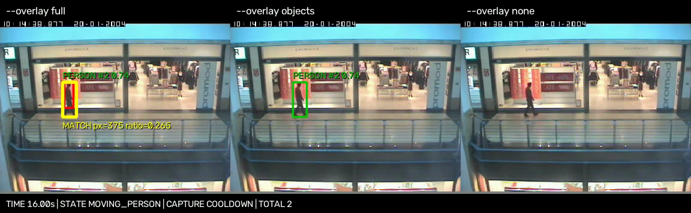
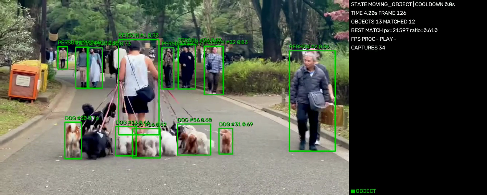

# 바로 실행할 수 있는 공개 예제

저장소에 입력 영상 두 개와 실제 처리 결과 두 개를 포함했다. 별도 영상 다운로드는 필요 없다.
프로젝트 루트에서 README의 Python 의존성과 `models/yolo11n.pt`를 준비한 뒤 실행한다.
Windows에서는 `./motion` 대신 `.\motion.cmd`를 사용한다.

| 예제 | 입력 | 처리 결과 | 확인할 내용 |
| - | - | - | - |
| 고정 카메라의 보행자 | [CAVIAR 입력](videos/caviar_stop_resume.mp4) | [세 가지 표시 비교](results/caviar_overlay_comparison.mp4) | 탐지·움직임 결합과 노란 강조 표시 끄기 |
| 사람과 개 | [산책 입력](videos/dog_walker_tokyo.mp4) | [박스·번호 처리 영상](results/dog_walker_annotated.mp4) | 종류 선택, 추적 번호와 객체별 저장 간격 |

이미지를 누르면 처리 영상 파일로 이동한다.

[](results/caviar_overlay_comparison.mp4)

[](results/dog_walker_annotated.mp4)

```bash
./motion video examples/videos/caviar_stop_resume.mp4
./motion video examples/videos/caviar_stop_resume.mp4 --overlay objects
./motion video examples/videos/caviar_stop_resume.mp4 --overlay none
./motion video examples/videos/dog_walker_tokyo.mp4 --objects 사람 개
./motion video examples/videos/dog_walker_tokyo.mp4 --objects 사람 개 --overlay objects
```

첫 영상은 384×288 / 25 FPS / 29초, 두 번째는 1920×1080 / 30 FPS / 약 9초다.
입력 해상도는 다르지만 같은 모듈로 처리한다. 분석 너비는 최대 960픽셀이고,
저장 JPG는 입력 해상도의 원본 전체 프레임이다.
실행하면 `captures/<run_id>/`에 JPG, `logs/<run_id>/`에 로그가 생기며 실제 폴더를 터미널에 표시한다.

비교 영상의 왼쪽은 `full`, 가운데는 `objects`, 오른쪽은 `none`이다.
세 화면은 동일한 탐지·추적·판정 결과를 사용하며, 캡처 상태는 아래쪽 문구로 확인한다.
비교를 위해 상태 패널을 잘랐으므로 실제 실행 창과 배치는 다르다.
사람·개 처리 영상은 읽기 쉬운 `objects` 모드로 객체 박스·번호와 상태 패널을 보여준다.
처리 영상은 `main.py`의 프레임별 로그와 같은 설정으로 재계산한 MOG2 결과를 렌더링한 것이다.
H.264 / yuv420p / faststart MP4로 저장해 일반 영상 플레이어에서 볼 수 있다.

## 검증 범위

이번 실행은 CAVIAR 725프레임 / JPG 15장, 사람·개 영상 271프레임 / JPG 102장이었다.
간격은 전체 JPG 기준이 아니라 각 추적 번호 기준이다. 여러 번호가 서로 다른 프레임에서
저장 조건을 만족하면 전체 JPG 수는 초당 2장보다 많아질 수 있다.
산책 영상의 카메라 움직임과 가림 때문에 사람 26개·개 31개의 추적 번호가 생겼으며,
이는 실제 개체 수가 아니다. 이동 카메라에서는 번호 연속성과 MOG2 판정이 좋지 않은 점도 드러난다.

[실행 결과와 체크섬](results/summary.json)에 실제 처리 프레임, JPG 수,
객체별 캡처 간격, 탐지 종류, 검증 결과와 사용한 모델·코드의 SHA-256을 기록했다.
전체 프레임 처리, 최초 2초 배경 학습 중 저장 없음, 객체별 최소 0.5초 저장 간격,
추적 확인 전 저장 없음, JPG와 박스 없는 입력 프레임의 JPEG 인코딩 결과 일치를 확인한다.
입력·처리 MP4는 OpenCV와 FFmpeg로 각각 전체 디코딩해 프레임 수를 확인한다.

기능을 확인하는 예제이며 탐지 정확도·정지 판정 정확도의 정답 비교 점수는 제공하지 않는다.
개 산책 영상에는 카메라 움직임과 가림이 있어 종류·번호 확인용으로 사용한다.
실제 MOG2 운용 조건은 고정 카메라이며, 이 영상의 캡처 결과를 그 정확도의 근거로 사용하지 않는다.
추적 번호의 개수도 실제 사람·개의 개체 수를 뜻하지 않는다.

## 처리 영상을 다시 만들기

```bash
.venv/bin/python -m pip install -r requirements-dev.txt
.venv/bin/python tools/build_demo_videos.py
```

이 도구는 포함된 입력의 체크섬을 확인한 뒤 실제 `main.py`를 실행한다.
간편 CLI와 같은 사람 탐지 신뢰도 0.4, 기준 전경 면적 1000픽셀, 추적 확인 3회,
객체별 0.5초 쿨다운을 사용한다. 산책 예제는 사람과 개를 함께 선택한다.
처리 MP4와 요약은 `examples/results/`에 다시 생성한다.
검증용 JPG·전체 로그·중간 MP4는 Git에서 제외된 `test_data/example_build/`에 생성한다.
플랫폼과 라이브러리 버전에 따라 탐지 결과·파일 체크섬이 달라질 수 있다.

영상의 저작자 표시·재배포 조건은 [ATTRIBUTION.md](ATTRIBUTION.md)를 확인한다.
